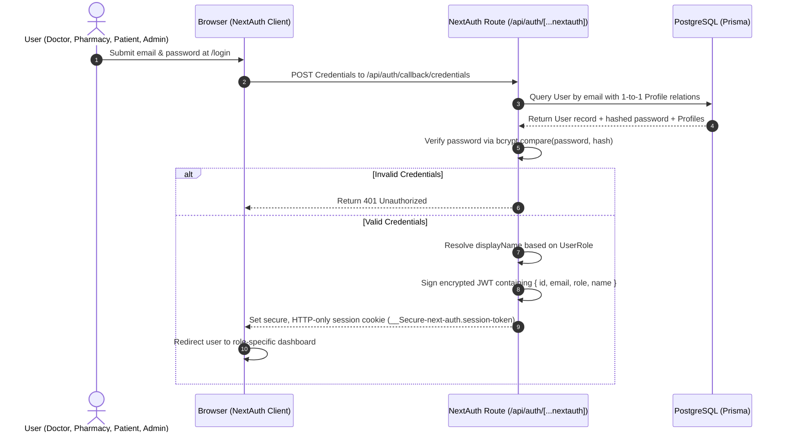
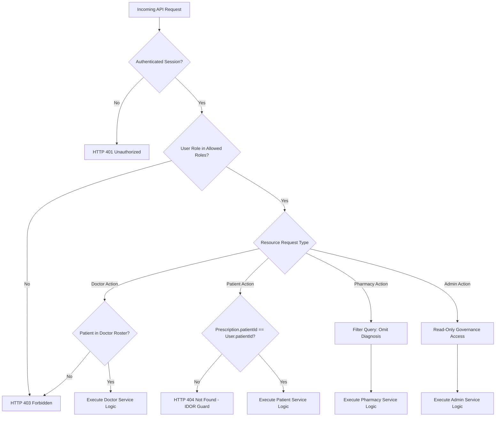
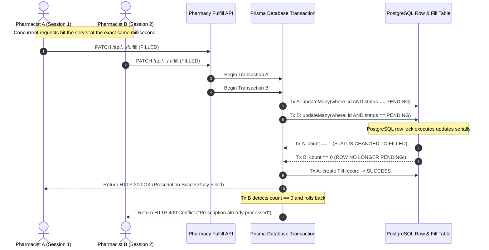
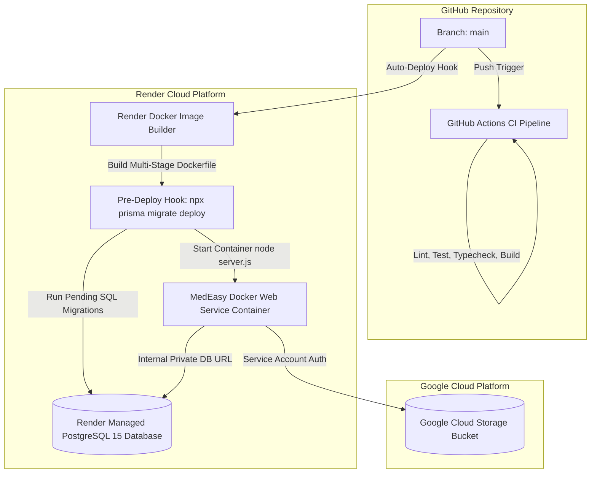

# MedEasy — High-Level Design (HLD)

## 1. System Overview

**MedEasy** is a centralized, role-based prescription-to-order tracking system designed to govern the end-to-end lifecycle of outpatient medical prescriptions. Built with Next.js 14, TypeScript, Prisma ORM, and PostgreSQL, the system coordinates four primary healthcare personas: **Doctors**, **Pharmacies**, **Patients**, and **System Administrators**.

The high-level architecture is engineered around three non-negotiable core principles:
1. **Zero-Trust Server Authorization:** The client is untrusted; all security boundaries, role permissions, and relationship rules are verified in server-side application logic.
2. **Concurrency-Safe Fulfillment:** Double-dispensing is physically prevented at the database transaction and schema constraint level.
3. **Clinical Privacy by Design:** Dispensing facilities receive complete pharmacological instructions while clinician diagnostic notes are redacted at the database query level.

---

## 2. Architecture Goals

- **Traceability & Integrity:** Guarantee an unbroken audit trail from clinician prescription issuance to pharmacy dispensing.
- **Race Condition Immunity:** Prevent duplicate fulfillment attempts by multiple pharmacy operators under high network concurrency.
- **Strict Role Isolation:** Ensure clinical, pharmaceutical, patient, and administrative boundaries are strictly maintained.
- **Data Minimization:** Expose only the specific data fields necessary for each role to complete their designated healthcare workflow.
- **Deployment Simplicity:** Deliver a containerized, cloud-agnostic application architecture deployed on **Render** with managed PostgreSQL and Google Cloud Storage.

---

## 3. System Context

The following diagram illustrates MedEasy's boundaries and interactions with human actors and external cloud services:

```mermaid
graph TD
    subgraph Actors [Healthcare Actors]
        Doctor[Attending Clinician]
        Pharmacy[Dispensing Pharmacist]
        Patient[Outpatient / Care Recipient]
        Admin[Hospital Compliance Admin]
    end

    subgraph MedEasyPlatform [MedEasy Production System on Render]
        AppServer[MedEasy Web Application<br/>Next.js 14 Standalone Container]
        HealthCheck[/api/health/db Endpoint]
    end

    subgraph ExternalServices [Data & Infrastructure Dependencies]
        DB[(Render Managed PostgreSQL 15<br/>Relational Data & Fills)]
        GCS[Google Cloud Storage Bucket<br/>Encrypted Prescription Scans]
        GitHubCI[GitHub Actions CI<br/>Automated Testing & Build]
    end

    Doctor -->|Issue Rx, Roster Mgmt| AppServer
    Pharmacy -->|Dispense / Reject Rx| AppServer
    Patient -->|Track Orders, View Rx| AppServer
    Admin -->|Audit Trail & Metrics| AppServer

    AppServer -->|Prisma Client / ACID Tx| DB
    AppServer -->|Private Object API| GCS
    AppServer -.-> HealthCheck

    GitHubCI -.->|Automated Test & Lint| AppServer
```

---

## 4. High-Level Architecture Diagram

```mermaid
flowchart TD
    subgraph ClientTier [Client Presentation Layer]
        Browser[Web Browser / React 18 UI]
        RoleGuard[RoleGuard.tsx<br/>UX Navigation Layer]
    end

    subgraph ServerTier [Next.js App Router Application Tier]
        AppRouter[Next.js App Router Engine]
        APIRoutes[API Route Handlers<br/>/app/api/*]
        AuthMiddleware[NextAuth.js v4 JWT Engine]
        PermsEngine[Permissions & RBAC Gateway<br/>lib/permissions.ts]
        DomainServices[Domain Service Layer<br/>doctor-service | pharmacy-service<br/>patient-service | admin-service]
        ErrorManager[Centralized Error Handler<br/>lib/api-errors.ts]
    end

    subgraph DataTier [Persistence & Storage Tier]
        PrismaClient[Prisma ORM Client v6]
        StorageClient[CloudStorageService Abstraction]
        PostgresDB[(PostgreSQL 15 Database<br/>Users, Roster, Prescriptions, Fills)]
        CloudBucket[(Google Cloud Storage<br/>Encrypted PDF & Image Attachments)]
    end

    Browser -->|HTTPS Requests| AppRouter
    AppRouter --> RoleGuard
    AppRouter --> APIRoutes
    
    APIRoutes --> AuthMiddleware
    APIRoutes --> PermsEngine
    APIRoutes --> DomainServices
    DomainServices --> ErrorManager
    
    DomainServices --> PrismaClient
    DomainServices --> StorageClient
    
    PrismaClient -->|SQL Connection Pool| PostgresDB
    StorageClient -->|Private Service Account API| CloudBucket
```

---

## 5. Application Layers

The application is architected into five distinct, loosely coupled layers:

```
┌────────────────────────────────────────────────────────────────────────┐
│ 1. Presentation Layer (React 18 / TailwindCSS)                         │
│    • Client Components ('use client') for interactive forms & modals   │
│    • Shared layout shells (DashboardShell, Sidebar, Header)            │
│    • Client UX route guard (RoleGuard.tsx)                             │
├────────────────────────────────────────────────────────────────────────┤
│ 2. API & Route Handler Layer (app/api/*)                               │
│    • Next.js App Router REST endpoints with force-dynamic evaluation   │
│    • Request body extraction, whitelisting, and parameter validation   │
│    • Standardized JSON envelopes (apiSuccess, apiError)                │
├────────────────────────────────────────────────────────────────────────┤
│ 3. Security & Authorization Gateway (lib/permissions.ts)               │
│    • requireAuth() & requireRole() session guards                      │
│    • Resource ownership predicates (canUserAccessPrescription)         │
│    • Roster association checks (isPatientInDoctorRoster)               │
│    • Privacy sanitization (sanitizePrescriptionForPharmacy)           │
├────────────────────────────────────────────────────────────────────────┤
│ 4. Domain Service Layer (lib/*-service.ts)                             │
│    • doctor-service.ts: Multi-med authoring, roster management         │
│    • pharmacy-service.ts: Concurrency-safe fulfillment, history, stats │
│    • patient-service.ts: IDOR-proof queries, tracking stepper logic    │
│    • admin-service.ts: Global audit queries, platform analytics        │
├────────────────────────────────────────────────────────────────────────┤
│ 5. Persistence & Storage Layer (lib/prisma.ts, lib/storage.ts)         │
│    • PrismaClient singleton managing PostgreSQL connection pooling     │
│    • CloudStorageService managing GCS signed streaming & local fallback │
└────────────────────────────────────────────────────────────────────────┘
```

---

## 6. Authentication Architecture

Authentication is powered by **NextAuth.js v4** using the stateless **JWT Session Strategy**:



### Stateless Token Structure
The encrypted JWT encapsulates the authenticated identity:
- `id`: Unique user identifier (CUID)
- `email`: Normalized user email address
- `role`: Canonical role enum (`DOCTOR`, `PHARMACY`, `PATIENT`, `ADMIN`)
- `name`: Hydrated display name (e.g., `Dr. Sarah Smith`, `MedEasy Central Pharmacy`)

This eliminates round-trip database queries for session validation on every HTTP request.

---

## 7. Authorization & Access Control Architecture

MedEasy enforces a multi-tiered authorization model:



### Clarification on Frontend vs. Backend Security Boundary
- `RoleGuard.tsx` is an interface enhancement that suppresses flicker and redirects unauthorized clients to `/login`.
- **The true security boundary is 100% server-side.** Even if an attacker uses curl, Postman, or modified browser code to call an endpoint, `lib/permissions.ts` rejects unauthorized requests before domain logic executes.

---

## 8. Prescription Lifecycle Architecture

```mermaid
stateDiagram-v2
    [*] --> PENDING : Doctor submits prescription (atomic transaction)
    
    state PENDING {
        description: Awaiting pharmacy review and fulfillment
    }

    PENDING --> FILLED : Pharmacy processes and dispenses
    PENDING --> CANNOT_FILL : Pharmacy rejects (stock/clinical reason)

    state FILLED {
        description: Terminal State. Immutable Fill record created.
    }

    state CANNOT_FILL {
        description: Terminal State. Marked unfillable.
    }

    FILLED --> [*]
    CANNOT_FILL --> [*]
```

### Lifecycle Guarantees
1. **Initial State Invariant:** No client or API call can create a prescription in any status other than `PENDING`.
2. **Terminal State Invariant:** Once a prescription transitions to `FILLED` or `CANNOT_FILL`, it is permanently sealed against future updates.
3. **Audit Immutability:** Fulfillments generate a dedicated `Fill` record capturing the dispensing pharmacy, timestamp, and notes.

---

## 9. Data Architecture

The system utilizes PostgreSQL 15 managed through Prisma ORM.

### Entity-Relationship Architecture

```mermaid
erDiagram
    User ||--o| DoctorProfile : "1:1"
    User ||--o| PharmacyProfile : "1:1"
    User ||--o| PatientProfile : "1:1"
    DoctorProfile ||--o{ DoctorPatient : "has many"
    PatientProfile ||--o{ DoctorPatient : "has many"
    DoctorProfile ||--o{ Prescription : "authors"
    PatientProfile ||--o{ Prescription : "receives"
    Prescription ||--|{ PrescriptionMedicine : "contains"
    Medicine ||--o{ PrescriptionMedicine : "catalog ref"
    Prescription ||--o| Fill : "has at most one"
    PharmacyProfile ||--o{ Fill : "dispenses"

    DoctorPatient {
        String id PK
        String doctorId FK
        String patientId FK
        DateTime createdAt
    }
    Prescription {
        String id PK
        String doctorId FK
        String patientId FK
        String diagnosis
        String documentRef
        PrescriptionStatus status
        DateTime filledAt
    }
    PrescriptionMedicine {
        String id PK
        String prescriptionId FK
        String medicineId FK
        String dosage
        String frequency
        String duration
    }
    Fill {
        String id PK
        String prescriptionId FK_UK
        String pharmacyId FK
        String notes
        DateTime filledAt
    }
```

### Relational Constraints & Indexing Strategy
- **`DoctorPatient`:** Composite unique constraint `@@unique([doctorId, patientId])` prevents duplicate roster entries. Indexed on `doctorId` and `patientId`.
- **`PrescriptionMedicine`:** Composite unique constraint `@@unique([prescriptionId, medicineId])` prevents duplicate drug entries.
- **`Fill`:** Unique constraint on `prescriptionId` (`@unique`) guarantees that a prescription can never have more than one successful dispensing record.
- **`Prescription`:** Indexed on `[doctorId]`, `[patientId]`, `[status]`, and `[createdAt]` for fast pagination and queue filtering.

---

## 10. Document Storage Architecture

MedEasy decouples metadata from heavy file binary storage:

```mermaid
flowchart LR
    Clinician[Clinician UI] -->|1. Multipart Form Upload| UploadAPI[/api/doctor/prescriptions/upload]
    UploadAPI -->|2. Validate Size & MIME| StorageService[StorageService Layer]
    StorageService -->|3. Put Private Object| GCS[(Google Cloud Storage Bucket)]
    StorageService -->|4. Return documentRef| UploadAPI
    UploadAPI -->|5. Return documentRef string| Clinician
    Clinician -->|6. POST Rx + documentRef| RxAPI[/api/doctor/prescriptions]
    RxAPI -->|7. Store documentRef in row| DB[(PostgreSQL)]

    AuthorizedUser[Authorized Viewer] -->|8. Request File| DocAPI[/api/prescriptions/id/document]
    DocAPI -->|9. Verify Ownership in DB| DB
    DocAPI -->|10. Stream Bytes with nosniff| GCS
    DocAPI -->|11. Binary Stream| AuthorizedUser
```

### Key Security Implementations:
1. **Anti-Traversal Sanitization:** Strips path traversal characters (`..`, `/`, `\`) and null bytes.
2. **Unguessable Storage Keys:** Files are renamed to `rx-docs/{timestamp}-{uuid}-{sanitizedName}.ext`.
3. **Secure Streaming Proxy:** Files in GCS have private ACLs. Clients cannot download them directly; they must request `/api/prescriptions/[id]/document`, which checks RBAC permissions before streaming bytes with `X-Content-Type-Options: nosniff`.
4. **Environment Portability:** When GCS environment variables are omitted, `CloudStorageService` seamlessly falls back to an in-memory mock store for local development.

---

## 11. Fulfillment Integrity & Concurrency Architecture

A critical vulnerability in naive prescription systems is the **time-of-check to time-of-use (TOCTOU) race condition**: two pharmacy workers opening the same pending prescription simultaneously and both clicking "Fulfill".

### Concurrency Protection Mechanism
MedEasy implements defense-in-depth across three architectural tiers:



### Defense-in-Depth Layers:
1. **Pre-Check Guard:** Initial query checks `prescription.status === PENDING`. If already `FILLED` or `CANNOT_FILL`, rejects with 409.
2. **Conditional Atomic Update:** Executes `updateMany({ where: { id: prescriptionId, status: 'PENDING' }, data: { status: 'FILLED' } })`. If another process changed the status, `count === 0`, triggering an immediate rollback and 409 Conflict.
3. **Database Unique Constraint Guard:** Even if raw SQL bypassed the update check, `Fill.prescriptionId` is marked `@unique`. An attempt to insert a second fill throws PostgreSQL unique violation `P2002`, which is caught and returned as a safe 409 Conflict.

---

## 12. Error Architecture

All API routes implement centralized error handling via `lib/api-errors.ts`:

```
┌─────────────────────────────────────────────────────────────┐
│                   Domain Service or Route                   │
│         throws ApplicationError / Prisma Client Error       │
└──────────────────────────────┬──────────────────────────────┘
                               │
                               ▼
┌─────────────────────────────────────────────────────────────┐
│                  apiError() Catch Handler                   │
│   • Matches ApplicationError code (VALIDATION, CONFLICT, etc)│
│   • Translates Prisma error codes (P2002 -> 409, P2025 -> 404)│
│   • Logs internal errors server-side                        │
│   • Masks unhandled exceptions as generic 500               │
└──────────────────────────────┬──────────────────────────────┘
                               │
                               ▼
┌─────────────────────────────────────────────────────────────┐
│                 Client Response Envelope                    │
│   HTTP Status: 400 | 401 | 403 | 404 | 409 | 422 | 500      │
│   Body: { "error": { "code": "...", "message": "..." } }    │
└─────────────────────────────────────────────────────────────┘
```

---

## 13. Analytics Architecture

Analytics are calculated directly from live transactional records without asynchronous ETL delays:

- **Aggregations:** Executed using Prisma's `groupBy` and `count` for status breakdowns.
- **Zero-Division Safe Calculations:**
  $$\text{fulfillmentRate} = \text{total} > 0 \ ? \ \text{Number}\left(\left(\frac{\text{filled}}{\text{total}} \times 100\right)\text{.toFixed}(1)\right) : 0$$
- **Time-Series Bucketing:** Utilizes raw SQL queries with PostgreSQL `date_trunc('day', "filledAt")` and `date_trunc('week', "filledAt")` to produce accurate volume trend charts.

---

## 14. Deployment Architecture (Render)

> **Clarification on Infrastructure Evolution:** Early project runbooks explored Google Cloud Run. The final, verified production deployment platform for MedEasy is **Render**, utilizing containerized Docker web services and managed PostgreSQL. Google Cloud Storage is retained strictly for object storage.



### Production Specifications:
- **Service Type:** Render Web Service
- **Runtime:** `Docker` (Multi-stage `Dockerfile`, non-root user `nextjs`, port `8080`)
- **Database:** Render PostgreSQL 15 (connected via Internal Database URL for zero latency)
- **Migration Strategy:** Automated pre-deploy command `npx prisma migrate deploy`
- **Health Check:** `/api/health/db` monitored continuously by Render

---

## 15. Scaling & Reliability Considerations

- **Stateless Application Tier:** The Next.js container stores no local session state (stateless JWTs). Multiple container replicas can be spun up behind Render's load balancer without session affinity issues.
- **Database Connection Pooling:** Prisma Client manages connection pooling to PostgreSQL.
- **Ephemeral Storage Resilience:** File uploads are streamed to GCS or in-memory mock rather than local container disk, ensuring uploads persist across Render container rebuilds.

---

## 16. Security Architecture Summary

| Security Domain | Architectural Mechanism | Implementation File |
|---|---|---|
| **Authentication** | Stateless JWT via NextAuth.js | `lib/auth.ts` |
| **Password Security** | 10-round salted bcrypt hashing | `lib/auth-service.ts` |
| **RBAC Enforcement** | Server-side role validation | `lib/permissions.ts` |
| **Relationship Enforcement**| DoctorPatient roster lookup | `lib/permissions.ts`, `lib/doctor-service.ts` |
| **Privacy Redaction** | Query-level exclusion & serializer scrubbing | `lib/permissions.ts`, `lib/pharmacy-service.ts` |
| **Concurrency Protection**| Atomic conditional update + unique constraint | `lib/pharmacy-service.ts` |
| **IDOR Mitigation** | Direct query scoping by profile ID | `lib/patient-service.ts`, `lib/doctor-service.ts` |
| **Storage Security** | Anti-traversal check + private stream proxy | `lib/storage.ts`, `app/api/prescriptions/[id]/document/route.ts` |

---

## 17. Technology Responsibilities Table

| Component | Primary Responsibility | Upstream Dependency | Downstream Consumers |
|---|---|---|---|
| **Next.js App Router** | Page routing, server-rendered layouts, API routing | Node.js runtime | Client web browser |
| **NextAuth.js** | Credential validation, token issuance, session verification | `bcryptjs`, `prisma.user` | API route handlers |
| **Permissions Gateway** | Role verification, resource ownership predicates | NextAuth session | Domain services |
| **Prisma ORM** | Type-safe database queries, migrations, transactions | PostgreSQL engine | Domain services |
| **CloudStorageService** | Attachment uploading, key generation, signed streaming | `@google-cloud/storage` | Prescription routes |
| **Render Web Service** | Production container hosting, restart management, TLS | Dockerfile | Internet traffic |

---

## 18. Major Architectural Decisions (ADRs)

### ADR-01: Adoption of Render as Final Hosting Platform
- **Context:** Initial prototypes explored Google Cloud Run. However, Render offered tightly integrated managed PostgreSQL with private network peering, frictionless pre-deploy migration hooks, and containerized Docker runtime.
- **Decision:** Deploy production application and database on Render. Retain GCS strictly for object storage.

### ADR-02: Frontend Doctor-Patient Assignment Feature
- **Context:** Clinicians needed an intuitive way to onboard existing registered patients into their care roster directly within the clinical application workflow.
- **Decision:** Implement dedicated frontend modal (`AssignPatientModal`) backed by `GET /api/doctor/patients/available` and `POST /api/doctor/patients/assign`, enforcing unique join constraints.

### ADR-03: Query-Level Diagnosis Redaction for Pharmacies
- **Context:** Medical ethics and data protection regulations dictate that pharmacies only receive pharmacological data, not clinical diagnoses.
- **Decision:** Omit the `diagnosis` column in Prisma `select` clauses for pharmacy views and enforce scrubbing via `sanitizePrescriptionForPharmacy()`.

### ADR-04: Concurrency Safety via Dual-Layer Guard
- **Context:** Under network latency or duplicate clicks, two pharmacists could attempt to fulfill the same prescription concurrently.
- **Decision:** Combine atomic conditional updates (`updateMany` with `status: PENDING`) with a database-level 1-to-1 unique constraint on `Fill.prescriptionId`.

---

## 19. Known Architecture Trade-offs & Limitations

1. **Pre-Provisioned Central Pharmacy:**
   *Trade-off:* Eliminates complex geographic routing algorithms in Sprint 1, but restricts deployment to a single central dispensing facility.
2. **Stateless JWT Revocation Window:**
   *Trade-off:* Stateless JWTs avoid database session lookups on every request, but tokens remain valid until expiration (no real-time token blacklisting).
3. **Ephemeral Local Storage Fallback:**
   *Trade-off:* When GCS credentials are not configured, files are held in-memory. This enables zero-config local development, but uploads are lost if a container restarts without GCS configured.
