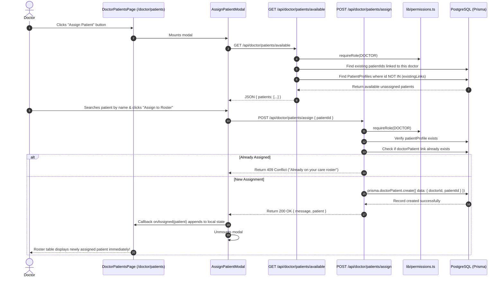
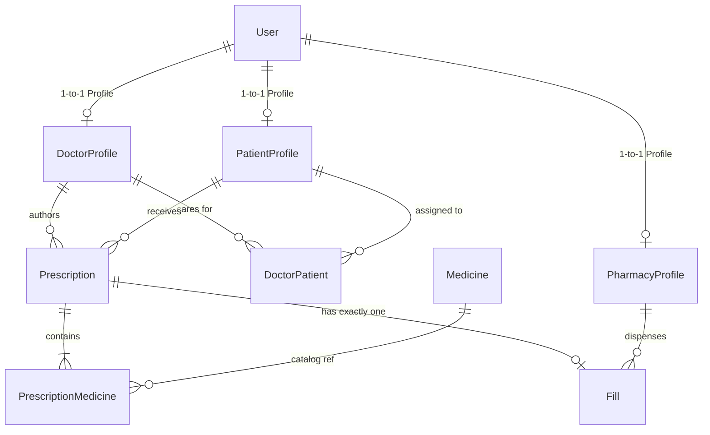
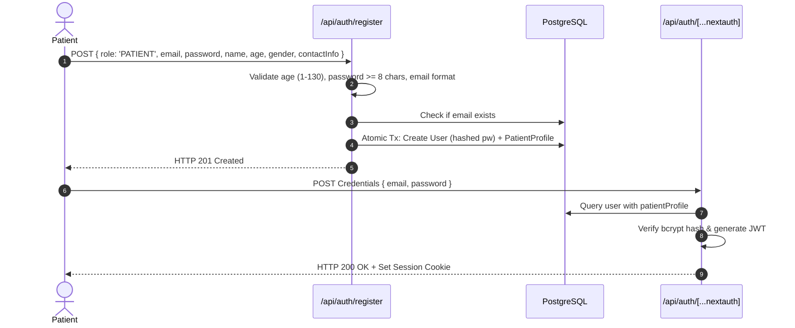
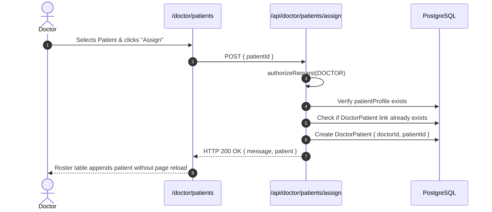
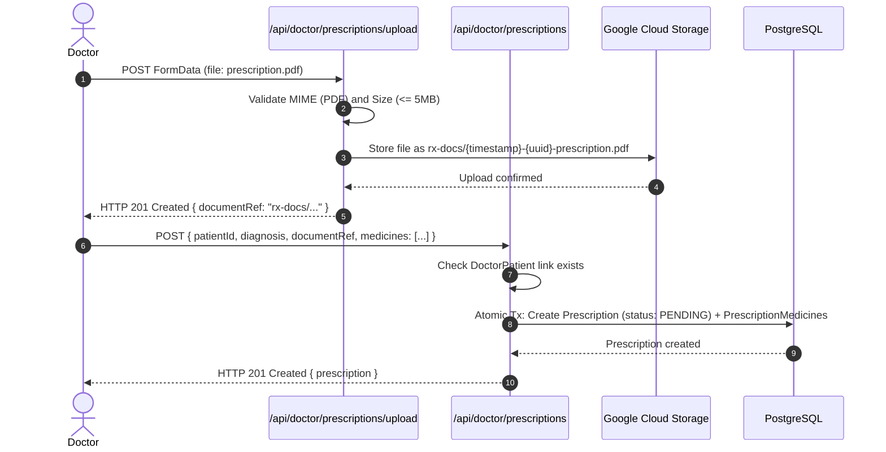
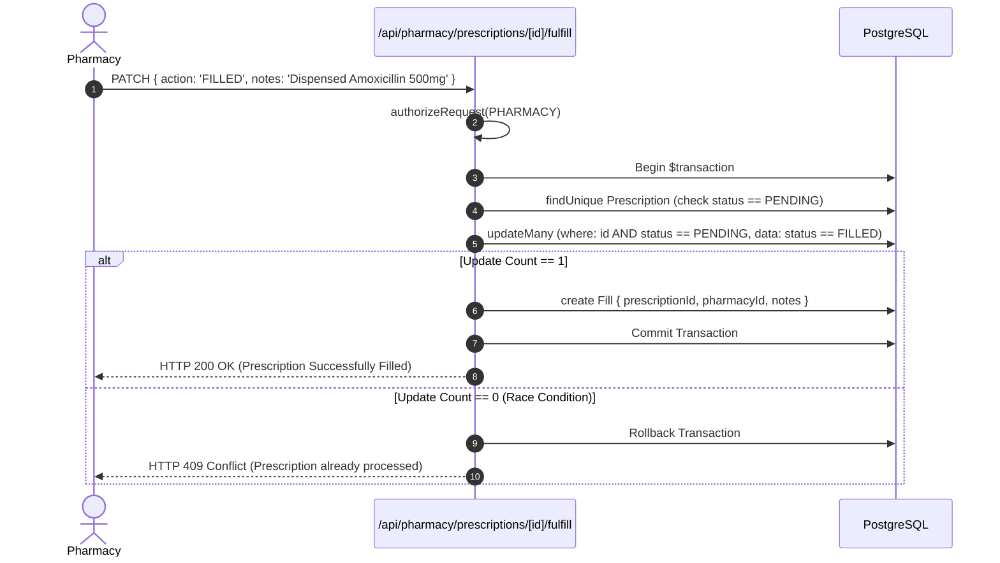
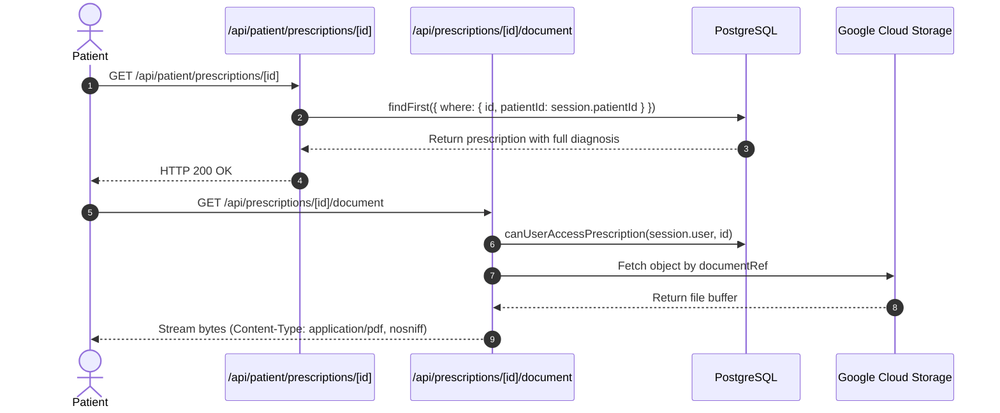

# MedEasy — Low-Level Design (LLD)

## 1. Overview

This Low-Level Design (LLD) document provides a detailed, code-level specification of the **MedEasy Prescription-to-Order Tracking System**. Every endpoint, data model, helper function, security predicate, and transaction boundary documented here reflects the active codebase in this repository.

---

## 2. Repository Structure

```
SW2627_Nextjs_Prescription_To_Order_Tracking_System/
├── app/                                # Next.js App Router
│   ├── admin/                          # Admin pages
│   │   ├── analytics/page.tsx          # Platform analytics
│   │   ├── dashboard/page.tsx          # Admin dashboard
│   │   ├── doctors/page.tsx            # Doctor directory & rosters
│   │   ├── layout.tsx                  # Admin shell layout
│   │   ├── pharmacy/page.tsx           # Pharmacy status
│   │   └── prescriptions/page.tsx      # Master prescription audit
│   ├── api/                            # REST API Route Handlers
│   │   ├── admin/                      # Admin reporting APIs
│   │   ├── auth/                       # NextAuth, registration, password reset
│   │   ├── doctor/                     # Prescriptions, roster, assign, upload
│   │   ├── health/db/route.ts          # Database connectivity check
│   │   ├── patient/                    # Patient queries & tracking
│   │   ├── pharmacy/                   # Fulfillment queue & actions
│   │   └── prescriptions/              # Detail lookup & private document streaming
│   ├── doctor/                         # Doctor pages
│   │   ├── analytics/page.tsx          # Practice analytics
│   │   ├── dashboard/page.tsx          # Doctor overview
│   │   ├── layout.tsx                  # Doctor shell layout
│   │   ├── patients/page.tsx           # Roster & AssignPatientModal
│   │   ├── prescriptions/              # Directory, creation wizard, details
│   │   └── profile/page.tsx            # Clinician profile
│   ├── forgot-password/page.tsx        # Password reset initiation
│   ├── login/page.tsx                  # NextAuth sign-in form
│   ├── patient/                        # Patient pages
│   │   ├── dashboard/page.tsx          # Patient dashboard
│   │   ├── layout.tsx                  # Patient shell layout
│   │   ├── prescriptions/              # Prescriptions list & details
│   │   ├── profile/page.tsx            # Patient profile
│   │   └── tracking/page.tsx           # Live fulfillment progress stepper
│   ├── pharmacy/                       # Pharmacy pages
│   │   ├── analytics/page.tsx          # Dispensing metrics
│   │   ├── dashboard/page.tsx          # Queue summary
│   │   ├── history/page.tsx            # Dispensing history log
│   │   ├── layout.tsx                  # Pharmacy shell layout
│   │   ├── prescriptions/              # Review & fulfillment actions
│   │   ├── profile/page.tsx            # Pharmacy profile
│   │   └── queue/page.tsx              # Active dispensing queue
│   ├── register/                       # Self-service onboarding
│   │   ├── doctor/page.tsx             # Clinician registration form
│   │   └── patient/page.tsx            # Patient registration form
│   ├── reset-password/page.tsx         # Password reset token form
│   ├── globals.css                     # Global Tailwind styles
│   ├── layout.tsx                      # Root layout with SessionProvider
│   └── page.tsx                        # Root redirect to /login
├── components/                         # Modular React components
│   ├── auth/                           # RoleGuard, AuthForm, PasswordResetForm
│   ├── layout/                         # DashboardShell, Header, Sidebar
│   ├── prescriptions/                  # PrescriptionCard, Details, Table, Status
│   ├── providers/                      # NextAuth SessionProvider wrapper
│   └── ui/                             # AccessDenied, Badge, Button, Card, Modal, Input, Spinner
├── lib/                                # Domain logic and utilities
│   ├── admin-service.ts                # Admin queries & aggregations
│   ├── api-errors.ts                   # Standardized error classes & helpers
│   ├── auth-service.ts                 # User creation & credential checking
│   ├── auth.ts                         # NextAuth configuration options
│   ├── client-errors.ts                # Client-side API error parser
│   ├── doctor-service.ts               # Roster management & prescription creation
│   ├── navigation.ts                   # Role navigation links
│   ├── password-reset-service.ts       # Password token creation & verification
│   ├── patient-service.ts              # Patient queries & tracking descriptions
│   ├── permissions.ts                  # Server RBAC & ownership predicates
│   ├── pharmacy-service.ts             # Concurrency-safe fulfillment logic
│   ├── prisma.ts                       # Global PrismaClient singleton
│   ├── session.ts                      # Server session retrieval helper
│   └── storage.ts                      # Google Cloud Storage & mock service
├── prisma/                             # Database schema & migrations
│   ├── migrations/                     # Committed SQL migrations
│   ├── schema.prisma                   # PostgreSQL relational schema
│   └── seed.ts                         # Deterministic demo database seeder
├── scripts/                            # 23 automated integration & security test suites
├── Dockerfile                          # Multi-stage production container build
├── docker-compose.yml                  # Local development multi-service compose
├── package.json                        # Scripts & dependencies
└── tsconfig.json                       # TypeScript compiler options
```

---

## 3. Route & Page Map

The application defines 30 client routes across five distinct functional areas:

| Area | Route | Role | File Path | Purpose |
|---|---|:---:|---|---|
| **Public / Auth** | `/` | Public | `app/page.tsx` | Root redirect to `/login` |
| **Public / Auth** | `/login` | Public | `app/login/page.tsx` | NextAuth credentials sign-in form |
| **Public / Auth** | `/register/doctor` | Public | `app/register/doctor/page.tsx` | Clinician onboarding form with license number |
| **Public / Auth** | `/register/patient` | Public | `app/register/patient/page.tsx` | Patient onboarding form with demographics |
| **Public / Auth** | `/forgot-password` | Public | `app/forgot-password/page.tsx` | Request password reset token |
| **Public / Auth** | `/reset-password` | Public | `app/reset-password/page.tsx` | Update password via token |
| **Doctor** | `/doctor/dashboard` | `DOCTOR` | `app/doctor/dashboard/page.tsx` | Summary metrics and recent activity |
| **Doctor** | `/doctor/patients` | `DOCTOR` | `app/doctor/patients/page.tsx` | Patient roster directory & **AssignPatientModal** |
| **Doctor** | `/doctor/prescriptions` | `DOCTOR` | `app/doctor/prescriptions/page.tsx` | Authored prescriptions table with status filters |
| **Doctor** | `/doctor/prescriptions/new` | `DOCTOR` | `app/doctor/prescriptions/new/page.tsx` | Multi-medicine authoring form & file upload |
| **Doctor** | `/doctor/prescriptions/[id]` | `DOCTOR` | `app/doctor/prescriptions/[id]/page.tsx` | Clinical view of authored prescription |
| **Doctor** | `/doctor/analytics` | `DOCTOR` | `app/doctor/analytics/page.tsx` | Practice prescribing trends & metrics |
| **Doctor** | `/doctor/profile` | `DOCTOR` | `app/doctor/profile/page.tsx` | Clinician profile details |
| **Pharmacy** | `/pharmacy/dashboard` | `PHARMACY` | `app/pharmacy/dashboard/page.tsx` | Queue overview & today's fulfillment count |
| **Pharmacy** | `/pharmacy/queue` | `PHARMACY` | `app/pharmacy/queue/page.tsx` | Active dispensing queue (FIFO) |
| **Pharmacy** | `/pharmacy/prescriptions` | `PHARMACY` | `app/pharmacy/prescriptions/page.tsx` | Searchable prescription directory |
| **Pharmacy** | `/pharmacy/prescriptions/[id]` | `PHARMACY` | `app/pharmacy/prescriptions/[id]/page.tsx` | Review prescription & execute fulfill/cannot-fill |
| **Pharmacy** | `/pharmacy/history` | `PHARMACY` | `app/pharmacy/history/page.tsx` | Historical dispensing log |
| **Pharmacy** | `/pharmacy/analytics` | `PHARMACY` | `app/pharmacy/analytics/page.tsx` | Fulfillment rate, top 10 drugs, trends |
| **Pharmacy** | `/pharmacy/profile` | `PHARMACY` | `app/pharmacy/profile/page.tsx` | Dispensary details and license |
| **Patient** | `/patient/dashboard` | `PATIENT` | `app/patient/dashboard/page.tsx` | Active prescriptions & health overview |
| **Patient** | `/patient/prescriptions` | `PATIENT` | `app/patient/prescriptions/page.tsx` | Personal prescription history |
| **Patient** | `/patient/prescriptions/[id]` | `PATIENT` | `app/patient/prescriptions/[id]/page.tsx` | Prescription details with full clinical diagnosis |
| **Patient** | `/patient/tracking` | `PATIENT` | `app/patient/tracking/page.tsx` | Live fulfillment progress stepper |
| **Patient** | `/patient/profile` | `PATIENT` | `app/patient/profile/page.tsx` | Demographic information |
| **Admin** | `/admin/dashboard` | `ADMIN` | `app/admin/dashboard/page.tsx` | High-level platform health & metrics |
| **Admin** | `/admin/doctors` | `ADMIN` | `app/admin/doctors/page.tsx` | Clinician directory & care rosters |
| **Admin** | `/admin/pharmacy` | `ADMIN` | `app/admin/pharmacy/page.tsx` | Central pharmacy account status |
| **Admin** | `/admin/prescriptions` | `ADMIN` | `app/admin/prescriptions/page.tsx` | Master audit table of all prescriptions |
| **Admin** | `/admin/analytics` | `ADMIN` | `app/admin/analytics/page.tsx` | Platform fulfillment rate & volume trends |

---

## 4. API Endpoint Map

All 35 endpoints are defined as Next.js App Router Route Handlers (`route.ts`) with `export const dynamic = "force-dynamic"`:

| Method | Endpoint | Allowed Roles | Purpose | Main Validation | Response Codes |
|---|---|:---:|---|---|:---:|
| `POST` | `/api/auth/register` | Public | Register new doctor or patient | Email format, password $\ge 8$ chars, role check (blocks Admin/Pharm) | `201`, `400`, `403`, `409` |
| `POST` | `/api/auth/forgot-password` | Public | Generate password reset token | Valid email format | `200`, `400` |
| `POST` | `/api/auth/reset-password` | Public | Reset password with token | Token string, new password $\ge 8$ chars | `200`, `400` |
| `ALL` | `/api/auth/[...nextauth]` | Public | NextAuth handler | Credentials verification | `200`, `401` |
| `GET` | `/api/health/db` | Public | Database health check | Executes raw query to verify connectivity | `200`, `503` |
| `GET` | `/api/doctor/dashboard` | `DOCTOR` | Dashboard summary cards & activity | Valid session & DOCTOR role | `200`, `401`, `403` |
| `GET` | `/api/doctor/patients` | `DOCTOR` | Fetch doctor's assigned patient roster | Valid session & DOCTOR role | `200`, `401`, `403` |
| `GET` | `/api/doctor/patients/available` | `DOCTOR` | Fetch unassigned patients for modal | Scopes patients where `id notIn (assigned)` | `200`, `401`, `403` |
| `POST` | `/api/doctor/patients/assign` | `DOCTOR` | Assign patient to doctor roster | Requires `patientId`, checks existence & duplicate link | `200`, `400`, `403`, `404`, `409` |
| `GET` | `/api/doctor/roster` | `DOCTOR` | Alternative roster query endpoint | Valid session & DOCTOR role | `200`, `401`, `403` |
| `GET` | `/api/doctor/medicines` | `DOCTOR` | Fetch active medicine catalog | Valid session & DOCTOR role | `200`, `401`, `403` |
| `GET` | `/api/doctor/prescriptions` | `DOCTOR` | List authored prescriptions | Optional status query param | `200`, `400`, `401`, `403` |
| `POST` | `/api/doctor/prescriptions` | `DOCTOR` | Create multi-med prescription | Roster linkage, 1–50 meds, no duplicate meds, diagnosis $\le 2000$ | `201`, `400`, `401`, `403`, `404` |
| `POST` | `/api/doctor/prescriptions/upload`| `DOCTOR` | Upload prescription scan/PDF | Max 5MB, PDF/JPEG/PNG/WEBP, anti-path traversal | `201`, `400`, `401`, `403` |
| `GET` | `/api/doctor/prescriptions/[id]` | `DOCTOR` | Detailed view of authored prescription | Prescription ownership check | `200`, `401`, `403`, `404` |
| `GET` | `/api/doctor/analytics` | `DOCTOR` | Practice prescribing statistics | Valid session & DOCTOR role | `200`, `401`, `403` |
| `GET` | `/api/pharmacy/dashboard` | `PHARMACY` | Dispensing queue overview metrics | Valid session & PHARMACY role | `200`, `401`, `403` |
| `GET` | `/api/pharmacy/queue` | `PHARMACY` | Ingestion queue of PENDING prescriptions| Chronological order; **redacts diagnosis** | `200`, `401`, `403` |
| `GET` | `/api/pharmacy/prescriptions` | `PHARMACY` | Directory of pharmacy prescriptions | Optional status param; **redacts diagnosis** | `200`, `400`, `401`, `403` |
| `GET` | `/api/pharmacy/prescriptions/[id]`| `PHARMACY`| Review prescription details | Valid session & PHARMACY role; **redacts diagnosis** | `200`, `401`, `403`, `404` |
| `PATCH`| `/api/pharmacy/prescriptions/[id]/fulfill`| `PHARMACY`| Fulfill or reject prescription | `action: FILLED \| CANNOT_FILL`, notes $\le 1000$ chars, PENDING guard | `200`, `400`, `401`, `403`, `404`, `409` |
| `GET` | `/api/pharmacy/history` | `PHARMACY` | Historical log of dispensed orders | Valid session & PHARMACY role | `200`, `401`, `403` |
| `GET` | `/api/pharmacy/analytics` | `PHARMACY` | Fulfillment rate, top 10 drugs, trends | Valid session & PHARMACY role | `200`, `401`, `403` |
| `GET` | `/api/patient/dashboard` | `PATIENT` | Active prescriptions & health overview | Valid session & PATIENT role | `200`, `401`, `403` |
| `GET` | `/api/patient/prescriptions` | `PATIENT` | List patient's own prescriptions | Direct query scoped by `patientId` | `200`, `401`, `403` |
| `GET` | `/api/patient/prescriptions/[id]`| `PATIENT`| Prescription detail with diagnosis | Direct query scoped by `patientId` | `200`, `401`, `403`, `404` |
| `GET` | `/api/patient/prescriptions/[id]/tracking`| `PATIENT`| Dedicated fulfillment tracking info | Direct query scoped by `patientId` | `200`, `401`, `403`, `404` |
| `GET` | `/api/prescriptions/[id]` | Any Auth | Shared prescription detail lookup | Enforces granular ownership in `lib/permissions.ts` | `200`, `401`, `403`, `404` |
| `GET` | `/api/prescriptions/[id]/document`| Any Auth | Secure streaming of attached document | Checks ownership, streams bytes with nosniff header | `200`, `401`, `403`, `404` |
| `GET` | `/api/admin/dashboard` | `ADMIN` | System oversight summary cards | Valid session & ADMIN role | `200`, `401`, `403` |
| `GET` | `/api/admin/doctors` | `ADMIN` | Directory of registered physicians | Valid session & ADMIN role | `200`, `401`, `403` |
| `GET` | `/api/admin/pharmacy` | `ADMIN` | Central pharmacy account status | Valid session & ADMIN role | `200`, `401`, `403` |
| `GET` | `/api/admin/prescriptions` | `ADMIN` | Master audit table of all prescriptions | Optional status param | `200`, `400`, `401`, `403` |
| `GET` | `/api/admin/prescriptions/[id]`| `ADMIN` | Full audit view of single prescription | Valid session & ADMIN role | `200`, `401`, `403`, `404` |
| `GET` | `/api/admin/system-stats` | `ADMIN` | High-level platform entity counts | Valid session & ADMIN role | `200`, `401`, `403` |
| `GET` | `/api/admin/analytics` | `ADMIN` | Platform-wide fulfillment metrics | Valid session & ADMIN role | `200`, `401`, `403` |

---

## 5. Authentication Implementation

The authentication engine is defined in `lib/auth.ts`:

### Configuration & Callbacks
- **Strategy:** Stateless JWT (`session: { strategy: "jwt" }`).
- **Secret:** Read from `process.env.NEXTAUTH_SECRET`.
- **Credentials Provider:** Accepts `email` and `password`.
  1. Normalizes email: `credentials.email.toLowerCase().trim()`.
  2. Queries user with profile joins (`doctorProfile`, `pharmacyProfile`, `patientProfile`).
  3. Validates password: `await bcrypt.compare(credentials.password, user.password)`.
  4. Resolves `displayName`:
     - Patient: `patientProfile.name`
     - Pharmacy: `pharmacyProfile.pharmacyName`
     - Doctor: Derived capitalized name (`Dr. Sarah Smith`)
     - Admin: `"System Administrator"`
- **`jwt` Callback:** Copies `{ id, role, name, email }` into the JWT token payload.
- **`session` Callback:** Hydrates `session.user` from the token.

### Server Session Retrieval (`lib/session.ts`)
```typescript
import { getServerSession } from "next-auth/next";
import { authOptions } from "@/lib/auth";

export async function getCurrentUser() {
  const session = await getServerSession(authOptions);
  return session?.user ?? null;
}
```

---

## 6. Authorization Implementation

Enforced centrally in `lib/permissions.ts`:

### Core Helper Functions
1. **`requireAuth(userOverride?)`:**
   Returns authenticated `AuthUser` or throws `AuthorizationError("Authentication required.", 401)`.
2. **`requireRole(allowedRoles, userOverride?)`:**
   Calls `requireAuth()`. Verifies `allowedRoles.includes(user.role)`. Throws `AuthorizationError("Forbidden...", 403)` on mismatch.
3. **`authorizeRequest(options)`:**
   Catches errors cleanly and returns either `{ user, errorResponse: null }` or `{ user: null, errorResponse }`.
4. **`isPatientInDoctorRoster(doctorId, patientId)`:**
   Executes `prisma.doctorPatient.findUnique({ where: { doctorId_patientId: { doctorId, patientId } } })`. Returns boolean.
5. **`canUserAccessPrescription(user, prescriptionId)`:**
   - `ADMIN`: Allowed (audit).
   - `DOCTOR`: Allowed if `prescription.doctorId === doctorProfile.id` (ownership).
   - `PATIENT`: Allowed if `prescription.patientId === patientProfile.id` (ownership).
   - `PHARMACY`: Allowed, but invokes `sanitizePrescriptionForPharmacy()` to redact diagnosis.
6. **`sanitizePrescriptionForPharmacy(prescription)`:**
   Shallow copies prescription object and deletes the `diagnosis` property.

---

## 7. Doctor-Patient Assignment Trace

This feature is a fully implemented frontend and backend workflow, completely eliminating any need for database workarounds:



---

## 8. Prescription Creation Trace

Defined in `app/doctor/prescriptions/new/page.tsx`, `app/api/doctor/prescriptions/route.ts`, and `lib/doctor-service.ts`:

1. **Client Form Submission:**
   - Validates selected `patientId`, `diagnosis`, optional `documentRef`, and medicines array.
   - Posts JSON to `POST /api/doctor/prescriptions`.
2. **Server Route Handler:**
   - Invokes `authorizeRequest({ allowedRoles: [UserRole.DOCTOR] })`.
   - Whitelists only `patientId`, `diagnosis`, `documentRef`, and `medicines`.
3. **Domain Service (`createDoctorPrescription` in `lib/doctor-service.ts`):**
   - Validates `diagnosis.length <= 2000`.
   - Validates `medicines.length` between 1 and 50.
   - Validates duplicate medicines: `new Set(medicineIds).size === medicineIds.length`.
   - **Roster Verification:** Checks `prisma.doctorPatient.findUnique`. If unlinked, returns `403 Forbidden: "Access denied. You can only create prescriptions for patients assigned to your care roster."`
   - Validates all `medicineId` values exist in database catalog.
4. **Atomic Prisma Transaction:**
   ```typescript
   await prisma.$transaction(async (tx) => {
     return await tx.prescription.create({
       data: {
         doctorId: doctorProfile.id, // Strictly server session
         patientId: patientProfile.id,
         diagnosis: diagnosis.trim(),
         documentRef: documentRef || null,
         status: PrescriptionStatus.PENDING, // Strictly PENDING
         prescriptionMedicines: {
           create: medicines.map((m) => ({
             medicineId: m.medicineId,
             dosage: m.dosage,
             frequency: m.frequency,
             duration: m.duration,
           })),
         },
       },
     });
   });
   ```

---

## 9. Pharmacy Fulfillment & Concurrency Implementation

Defined in `lib/pharmacy-service.ts` (`fulfillPrescription`):

### Why `findUnique` alone is insufficient
In a high-concurrency environment, if two pharmacists inspect a prescription at the same time:
1. Process A reads `status == PENDING`.
2. Process B reads `status == PENDING`.
3. Process A updates `status = FILLED` and creates a Fill record.
4. Process B (without atomic guards) also updates `status = FILLED` and creates a duplicate Fill record.

### Code Implementation of Concurrency Protection
```typescript
export async function fulfillPrescription(
  userId: string,
  prescriptionId: string,
  input: FulfillPrescriptionInput
) {
  // 1. Role verification & pharmacy resolution
  const pharmacy = await getPharmacyOrError(userId);
  if ("error" in pharmacy) return pharmacy;

  const { action, notes } = input;
  if (action !== "FILLED" && action !== "CANNOT_FILL") {
    return { error: "Invalid action. Must be 'FILLED' or 'CANNOT_FILL'.", statusCode: 400 };
  }

  // 2. Atomic transaction with conditional update & unique constraint
  try {
    return await prisma.$transaction(async (tx) => {
      // Step A: Pre-check status
      const existing = await tx.prescription.findUnique({
        where: { id: prescriptionId },
        select: { id: true, status: true },
      });

      if (!existing) return { error: "Prescription not found.", statusCode: 404 };
      if (existing.status !== PrescriptionStatus.PENDING) {
        return {
          error: `Prescription has already been processed with status '${existing.status}'.`,
          statusCode: 409,
        };
      }

      const fulfillmentTimestamp = new Date();

      // Step B: Atomic conditional update
      if (action === "FILLED") {
        const updateResult = await tx.prescription.updateMany({
          where: { id: prescriptionId, status: PrescriptionStatus.PENDING },
          data: { status: PrescriptionStatus.FILLED, filledAt: fulfillmentTimestamp },
        });

        // If count is 0, another concurrent transaction updated it first
        if (updateResult.count === 0) {
          return { error: "Prescription has already been processed.", statusCode: 409 };
        }

        // Step C: Create immutable Fill record (guarded by unique Fill.prescriptionId)
        await tx.fill.create({
          data: {
            prescriptionId,
            pharmacyId: pharmacy.id,
            filledAt: fulfillmentTimestamp,
            notes: notes || null,
          },
        });
      } else {
        // CANNOT_FILL Action
        const updateResult = await tx.prescription.updateMany({
          where: { id: prescriptionId, status: PrescriptionStatus.PENDING },
          data: { status: PrescriptionStatus.CANNOT_FILL },
        });

        if (updateResult.count === 0) {
          return { error: "Prescription has already been processed.", statusCode: 409 };
        }
      }

      const updated = await tx.prescription.findUniqueOrThrow({
        where: { id: prescriptionId },
        select: pharmacyPrescriptionSelect, // Omits diagnosis
      });

      return {
        success: true,
        message: action === "FILLED" ? "Prescription successfully filled." : "Prescription marked as cannot fill.",
        prescription: formatPrescription(updated),
      };
    });
  } catch (error: unknown) {
    if (error instanceof Prisma.PrismaClientKnownRequestError && error.code === "P2002") {
      return { error: "Prescription has already been fulfilled.", statusCode: 409 };
    }
    return { error: "An unexpected error occurred during fulfillment.", statusCode: 500 };
  }
}
```

---

## 10. Patient Tracking Implementation

Defined in `lib/patient-service.ts`:

- **Query-Level IDOR Guard:**
  ```typescript
  const prescription = await prisma.prescription.findFirst({
    where: {
      id: prescriptionId,
      patientId: patientProfile.id, // Strictly scoped to authenticated caller
    },
    ...
  });
  ```
  If another patient's ID is requested, `prescription === null`, returning `404 Not Found`.

- **Tracking Message Engine (`getPrescriptionTrackingMessage`):**
  - `PENDING`: *"Prescription has been received and is currently awaiting pharmacy processing and fulfillment."*
  - `FILLED`: *"Prescription has been successfully verified, prepared, and dispensed by the pharmacy."*
  - `CANNOT_FILL`: *"Prescription cannot be fulfilled by the pharmacy at this time due to unavailable medication or fulfillment constraints. Please contact your prescribing clinician."*

---

## 11. Admin Implementation

Defined in `lib/admin-service.ts`:

- `getAdminDashboardData()`: Executes `Promise.all` across `doctorProfile.count()`, `patientProfile.count()`, `prescription.count()`, and `prescription.groupBy({ by: ['status'] })`.
- `getAdminDoctorsList()`: Lists all doctors with license numbers, specializations, emails, and patient counts.
- `getAdminPharmacyInfo()`: Retrieves central pharmacy licensing, dispensing fill counts, and configuration status (`ACTIVE` vs `NOT_CONFIGURED`).
- `getAdminPrescriptionsList()`: Master audit query returning all prescriptions with author doctor, recipient patient, and fulfillment status.

---

## 12. Complete Prisma Schema Specification

```prisma
datasource db {
  provider = "postgresql"
  url      = env("DATABASE_URL")
}

generator client {
  provider      = "prisma-client-js"
  binaryTargets = ["native", "debian-openssl-3.0.x", "rhel-openssl-3.0.x"]
}

enum UserRole {
  DOCTOR
  PHARMACY
  PATIENT
  ADMIN
}

enum PrescriptionStatus {
  PENDING
  FILLED
  CANNOT_FILL
}

model User {
  id        String   @id @default(cuid())
  email     String   @unique
  password  String
  role      UserRole
  createdAt DateTime @default(now())
  updatedAt DateTime @updatedAt

  doctorProfile   DoctorProfile?
  pharmacyProfile PharmacyProfile?
  patientProfile  PatientProfile?

  @@index([role])
}

model DoctorProfile {
  id             String   @id @default(cuid())
  userId         String   @unique
  user           User     @relation(fields: [userId], references: [id], onDelete: Cascade)
  specialization String
  licenseNumber  String   @unique
  phone          String
  createdAt      DateTime @default(now())
  updatedAt      DateTime @updatedAt

  doctorPatients DoctorPatient[]
  prescriptions  Prescription[]

  @@index([specialization])
}

model PharmacyProfile {
  id            String   @id @default(cuid())
  userId        String   @unique
  user          User     @relation(fields: [userId], references: [id], onDelete: Cascade)
  pharmacyName  String
  pharmacyType  String
  licenseNumber String   @unique
  phone         String
  createdAt     DateTime @default(now())
  updatedAt     DateTime @updatedAt

  fills Fill[]

  @@index([pharmacyName])
}

model PatientProfile {
  id          String   @id @default(cuid())
  userId      String   @unique
  user        User     @relation(fields: [userId], references: [id], onDelete: Cascade)
  name        String
  age         Int
  gender      String
  contactInfo String
  createdAt   DateTime @default(now())
  updatedAt   DateTime @updatedAt

  doctorPatients DoctorPatient[]
  prescriptions  Prescription[]

  @@index([name])
}

model DoctorPatient {
  id        String         @id @default(cuid())
  doctorId  String
  doctor    DoctorProfile  @relation(fields: [doctorId], references: [id], onDelete: Cascade)
  patientId String
  patient   PatientProfile @relation(fields: [patientId], references: [id], onDelete: Cascade)
  createdAt DateTime       @default(now())
  updatedAt DateTime       @updatedAt

  @@unique([doctorId, patientId])
  @@index([doctorId])
  @@index([patientId])
}

model Medicine {
  id          String   @id @default(cuid())
  name        String
  genericName String
  stockStatus Boolean  @default(true)
  createdAt   DateTime @default(now())
  updatedAt   DateTime @updatedAt

  prescriptionMedicines PrescriptionMedicine[]

  @@index([name])
  @@index([genericName])
}

model Prescription {
  id          String             @id @default(cuid())
  doctorId    String
  doctor      DoctorProfile      @relation(fields: [doctorId], references: [id], onDelete: Restrict)
  patientId   String
  patient     PatientProfile     @relation(fields: [patientId], references: [id], onDelete: Restrict)
  diagnosis   String
  documentRef String?
  status      PrescriptionStatus @default(PENDING)
  filledAt    DateTime?
  createdAt   DateTime           @default(now())
  updatedAt   DateTime           @updatedAt

  prescriptionMedicines PrescriptionMedicine[]
  fill                  Fill?

  @@index([doctorId])
  @@index([patientId])
  @@index([status])
  @@index([createdAt])
}

model PrescriptionMedicine {
  id             String       @id @default(cuid())
  prescriptionId String
  prescription   Prescription @relation(fields: [prescriptionId], references: [id], onDelete: Cascade)
  medicineId     String
  medicine       Medicine     @relation(fields: [medicineId], references: [id], onDelete: Restrict)
  dosage         String
  frequency      String
  duration       String
  createdAt      DateTime     @default(now())
  updatedAt      DateTime     @updatedAt

  @@unique([prescriptionId, medicineId])
  @@index([prescriptionId])
  @@index([medicineId])
}

model Fill {
  id             String          @id @default(cuid())
  prescriptionId String          @unique // 1-to-1 unique constraint prevents duplicate fills
  prescription   Prescription    @relation(fields: [prescriptionId], references: [id], onDelete: Cascade)
  pharmacyId     String
  pharmacy       PharmacyProfile @relation(fields: [pharmacyId], references: [id], onDelete: Restrict)
  notes          String?
  filledAt       DateTime        @default(now())
  createdAt      DateTime        @default(now())
  updatedAt      DateTime        @updatedAt

  @@index([pharmacyId])
  @@index([filledAt])
}
```

---

## 13. Database Relationship Diagram



---

## 14. Document Storage Implementation

Defined in `lib/storage.ts`:

- **Constraints:**
  - `ALLOWED_PRESCRIPTION_MIME_TYPES = ["application/pdf", "image/jpeg", "image/png", "image/webp"]`
  - `MAX_PRESCRIPTION_FILE_SIZE = 5 * 1024 * 1024` (5MB).
- **Validation (`validateDocumentFile`):** Checks non-empty buffer, file size limit, MIME whitelist, and filename traversal sequences.
- **Key Generation (`generateDocumentStorageKey`):**
  ```typescript
  return `rx-docs/${Date.now()}-${crypto.randomUUID()}-${sanitizedBaseName}${ext}`;
  ```
- **Service (`CloudStorageService`):**
  - Initializes `@google-cloud/storage` `Storage` client when `GCP_PROJECT_ID`, `GCP_CLIENT_EMAIL`, and `GCP_PRIVATE_KEY` are provided.
  - Falls back to `mockStorageStore` (in-memory `Map`) when GCS environment variables are absent.
- **Private Stream Route (`app/api/prescriptions/[id]/document/route.ts`):**
  - Authenticates caller and verifies access rights on the prescription in PostgreSQL.
  - Fetches file buffer from `storageService.getDocument(documentRef)`.
  - Streams binary response with headers:
    - `Content-Disposition: inline; filename="..."`
    - `X-Content-Type-Options: nosniff`
    - `Cache-Control: private, no-cache, no-store, must-revalidate`

---

## 15. Server vs. Client Components Architecture

Next.js App Router utilizes a hybrid architecture:

| Component / File | Render Type | Rationale |
|---|:---:|---|
| `app/layout.tsx` | Server Component | Emits base HTML shell, renders global CSS, hydrates SessionProvider |
| `app/doctor/layout.tsx` | Client Component | Uses `useSession()` in `RoleDashboardShell` for role verification and sidebar state |
| `app/doctor/patients/page.tsx` | Client Component | Contains reactive state for patient search, `AssignPatientModal`, and table updates |
| `app/doctor/prescriptions/new/page.tsx` | Client Component | Interactive multi-row medicine builder form with client validation and file drag-and-drop |
| `app/pharmacy/queue/page.tsx` | Client Component | Real-time queue filtering and quick fulfillment action triggers |
| `app/patient/tracking/page.tsx` | Client Component | Dynamic visual stepper reflecting real-time fulfillment state transitions |
| `app/admin/analytics/page.tsx` | Client Component | Interactive chart tabs, date range selections, and tabular metrics |
| `components/ui/*` | Client Components | Interactive primitives (Button, Modal, Input, Badge) with event listeners |

---

## 16. Test Automation Implementation

MedEasy includes 23 automated test suites in `scripts/`:

```
scripts/
├── test-admin-api.ts                   # Admin API endpoint contracts & authorization
├── test-admin-frontend.ts              # Admin dashboard data models
├── test-api-errors.ts                  # Standardized ApplicationError & status mapping
├── test-auth.ts                        # Password hashing, login, session issuance
├── test-authorization.ts               # Complete 401 vs 403 matrix & role boundaries
├── test-day16-full-regression.ts       # Full system-wide regression test suite
├── test-day16-shared-ui.ts             # Shared component props and render tests
├── test-day17-backend-security.ts      # Comprehensive security, abuse & IDOR audit (Default npm test)
├── test-day19-e2e-production.ts        # End-to-end multi-role flow simulation
├── test-day19-gcs-storage.ts           # GCS storage upload, validation & streaming
├── test-day9-doctor-detail-storage.ts  # Doctor detail queries & document association
├── test-doctor-analytics.ts            # Clinician analytics formula checks
├── test-doctor-api.ts                  # Doctor endpoints & roster isolation
├── test-doctor-create-prescription.ts  # Multi-medicine validation & transaction tests
├── test-doctor-integration.ts          # Doctor prescription issuance lifecycle
├── test-patient-api.ts                 # Patient queries & IDOR rejection tests
├── test-pharmacy-api.ts                # Pharmacy endpoints & queue verification
├── test-pharmacy-day13.ts              # Pharmacy history & analytics tests
├── test-pharmacy-fulfillment.ts        # State guards & terminal fulfillment tests
├── test-pharmacy-integration.ts        # Concurrency & double fulfillment tests
├── test-protected-navigation.ts        # Navigation permissions & link generation
└── smoke-test-deployment.ts            # Production smoke test for Render
```

Run via: `npm test` or `npm run test:<target>`.

---

## 17. Docker Implementation

Defined in `Dockerfile`:

- **Base Stage (`node:20-slim AS base`):**
  Installs `openssl` to guarantee compatibility with Prisma binary targets (`debian-openssl-3.0.x`).
- **Deps Stage (`FROM base AS deps`):**
  Mounts npm cache, runs `npm ci`, and executes `npx prisma generate`.
- **Dev Stage (`FROM deps AS dev`):**
  Configures development server for local Docker Compose development with hot-reload.
- **Builder Stage (`FROM base AS builder`):**
  Copies dependencies, runs `npx prisma generate`, and compiles Next.js standalone application (`npm run build`).
- **Runner Stage (`FROM node:20-slim AS runner`):**
  - Creates non-root group `nodejs` (GID 1001) and user `nextjs` (UID 1001).
  - Copies `.next/standalone`, `.next/static`, and `public`.
  - Retains Prisma CLI (`node_modules/prisma`) and `prisma/` for Render pre-deploy migrations.
  - Sets `USER nextjs`, `PORT 8080`, and runs `CMD ["node", "server.js"]`.

---

## 18. Continuous Integration (GitHub Actions)

Defined in `.github/workflows/ci.yml`:

1. **Environment:** Ubuntu-latest with a dedicated `postgres:15-alpine` container service.
2. **Pipeline Steps:**
   - Checkout code and setup Node.js 20.
   - Deterministic install: `npm ci`.
   - Prisma generation: `node node_modules/prisma/build/index.js generate`.
   - Apply migrations: `npx prisma migrate deploy`.
   - Seed test fixtures: `npm run db:seed`.
   - Linting: `npm run lint`.
   - TypeScript typechecking: `npx tsc --noEmit`.
   - Execute integration & security suites (11 distinct test runners).
   - Production build verification: `npm run build`.

---

## 19. Render Deployment Implementation

> **Notice:** Render is the authoritative final application hosting platform.

- **Web Service:** Render Docker Web Service pointed to repository `main` branch.
- **Managed Database:** Render PostgreSQL 15 connected via private **Internal Database URL**.
- **Pre-Deploy Migration Command:** `npx prisma migrate deploy`
- **Health Check Path:** `/api/health/db`

---

## 20. Environment Variables Catalog

| Variable Name | Required / Optional | Purpose |
|---|:---:|---|
| `NODE_ENV` | Required | Set to `production` in production, `development` locally |
| `DATABASE_URL` | Required | PostgreSQL connection string with schema parameter |
| `NEXTAUTH_URL` | Required | Canonical URL of web application (e.g. `https://medeasy.onrender.com`) |
| `NEXTAUTH_SECRET` | Required | 32+ character random string for signing JWT tokens |
| `GCP_PROJECT_ID` | Optional | Google Cloud project ID for GCS bucket access |
| `GCP_CLIENT_EMAIL` | Optional | Service account email with Storage Object User role |
| `GCP_PRIVATE_KEY` | Optional | Service account private key (with `\n` line breaks preserved) |
| `GCP_STORAGE_BUCKET`| Optional | Private Google Cloud Storage bucket name for prescription files |
| `PORT` | Auto (Render) | Server listening port (injected by Render, defaults to `8080`) |

---

## 21. Request Lifecycle Examples

### A. Patient Registration & Login


### B. Doctor-Patient Roster Assignment


### C. Prescription Creation with Document Attachment


### D. Concurrency-Safe Pharmacy Fulfillment


### E. Patient Prescription Access & Document Download


---

## 22. Known Implementation Gaps & Future Work

1. **Self-Service Pharmacy Registration:**
   *Current Reality:* The central dispensing pharmacy account is pre-provisioned via database seed.
   *Future Roadmap:* Administrative multi-tenant pharmacy onboarding workflow with state board license verification.
2. **Geographic Pharmacy Routing:**
   *Current Reality:* All pending prescriptions enter a single centralized pharmacy queue.
   *Future Roadmap:* Radius-based or patient-selected dispensing pharmacy routing.
3. **Physical Inventory Stock Deduction:**
   *Current Reality:* `Medicine.stockStatus` is a demonstration availability flag.
   *Future Roadmap:* Integration with pharmacy inventory management systems (NDCs, lot tracking, stock level decrementing).
