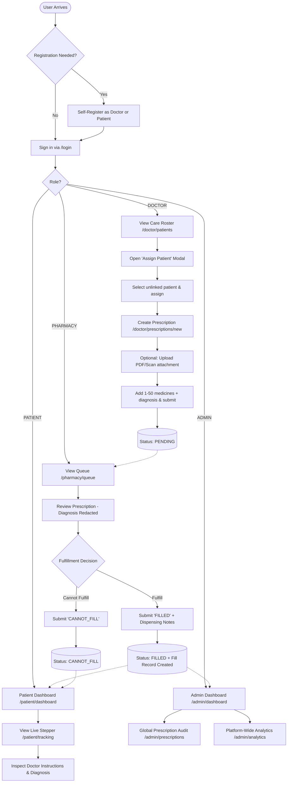
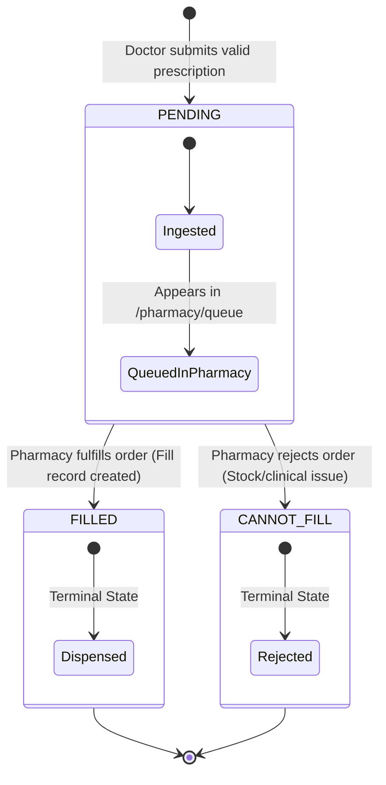

# MedEasy — Product Requirements Document (PRD)

## 1. Document Control

| Attribute | Details |
|---|---|
| **Product Name** | MedEasy — Prescription-to-Order Tracking System |
| **Document Version** | 1.0 (Final Implemented Baseline) |
| **Project Context** | Semester 3, Sprint 1 — Simulated Work Project Track |
| **Institution** | Kalvium |
| **Engineering Team** | Harshit Mohanta, Rudra Gopal, Divyesh RM |
| **Document Status** | **Final Implemented Baseline** (Reconciled with Active Codebase) |
| **Target Deployment** | Render (Application & PostgreSQL), Google Cloud Storage (Object Storage) |

---

## 2. Product Overview

**MedEasy** is a specialized healthcare workflow and tracking platform that digitizes the clinical prescription lifecycle from the moment a physician prescribes medication to its final dispensing by a pharmacy.

By connecting Attending Physicians, Dispensing Pharmacies, Patients, and Healthcare Administrators on a unified, role-governed platform, MedEasy replaces vulnerable paper prescriptions with an auditable, concurrency-safe digital state machine.

---

## 3. Problem Statement

Outpatient prescription and medication fulfillment in traditional healthcare systems suffer from severe structural breakdowns:

1. **Fragmentation & Paper Dependency:**
   Paper prescriptions are easily lost, damaged, forged, or misinterpreted due to illegible clinician handwriting.
2. **Duplicate Dispensing & Drug Diversion:**
   Without a centralized state machine, patients can present the same prescription to multiple dispensing facilities, enabling dangerous over-consumption or illicit resale of controlled substances.
3. **Clinical Privacy Exposure:**
   Paper slips display the patient's full medical diagnosis to retail clerks and technicians who only require pharmaceutical instructions, violating patient privacy and medical data protection standards.
4. **Fulfillment Opacity for Patients:**
   Patients have no visibility into pharmacy fulfillment pipelines. They often travel to a pharmacy only to discover that medications are out of stock or still being prepared.
5. **Absence of Governance & Auditing:**
   Healthcare institutions lack real-time visibility into physician prescribing patterns, dispensing turnaround times, or institutional unfulfilled order rates.

---

## 4. Product Vision

To provide a secure, transparent, and concurrency-safe digital prescription lifecycle platform where **doctors prescribe with clinical precision**, **pharmacies fulfill with integrity and patient privacy**, **patients track medication orders with confidence**, and **administrators maintain complete institutional oversight**.

---

## 5. Product Goals

- **Zero-Ambiguity Prescription Capture:** Enable doctors to issue structured, multi-medication digital prescriptions with standardized dosage, frequency, and duration.
- **Enforced Doctor-Patient Relationship:** Prevent unauthorized prescribing by requiring doctors to link patients to their care roster before issuing prescriptions.
- **Privacy-Preserving Fulfillment:** Provide pharmacies with all necessary dispensing details while strictly redacting clinician diagnosis notes.
- **Exactly-Once Fulfillment Guarantee:** Ensure through database-level constraints and atomic transactions that a prescription can only be fulfilled once, eliminating duplicate dispensing.
- **Real-Time Patient Visibility:** Give patients clear, non-speculative progress tracking across all lifecycle phases (`PENDING`, `FILLED`, `CANNOT_FILL`).
- **Institutional Governance:** Equip administrators with platform-level dashboards, doctor roster oversight, and fulfillment analytics.

---

## 6. Non-Goals & Out of Scope

To ensure delivery within the Sprint 1 timeframe, the following features were explicitly defined as out of scope:

| Feature / Area | Scope Determination | Rationale |
|---|---|---|
| **Inventory Stock Management** | Out of Scope | MedEasy tracks the *prescription order lifecycle*, not physical pharmacy warehouse warehouse stock movements, suppliers, or batch lots. The `stockStatus` boolean on medicines serves as a demo catalog indicator. |
| **Online Payment & Billing** | Out of Scope | Insurance claim adjudication, copays, and digital payment gateways are reserved for dedicated billing integrations. |
| **Physical Courier / Delivery Tracking** | Out of Scope | MedEasy manages fulfillment *within the dispensary*. Physical courier dispatch and GPS delivery tracking are post-dispensing concerns. |
| **Self-Service Pharmacy Registration** | Out of Scope | To ensure regulatory compliance, pharmacy profiles cannot self-register openly. Exactly one pre-provisioned central dispensing pharmacy is configured per deployment. |
| **Multi-Pharmacy Geographic Routing** | Phase 2 Scope | In Sprint 1, all issued prescriptions enter a centralized dispensing queue. Dynamic geo-routing based on patient address is planned for subsequent phases. |

---

## 7. User Personas

### Persona 1: Dr. Sarah Smith (Attending Physician)
- **Role:** `DOCTOR`
- **Needs:** Fast, structured prescription authoring; clear roster of patients under her care; ability to attach diagnostic reports or handwritten clinical scans; personal prescribing analytics.
- **Pain Points:** Burden of physical paperwork; inability to know if patients actually filled prescribed courses; worry over clinical liability.

### Persona 2: Marcus Vance (Central Dispensing Pharmacist)
- **Role:** `PHARMACY`
- **Needs:** Real-time queue of incoming prescriptions; quick verification of medications, dosages, and clinician signatures; one-click status updates (`FILLED` or `CANNOT_FILL`) with dispensing notes.
- **Pain Points:** Unclear handwriting; dealing with duplicate paper slips; exposure to sensitive diagnoses that are unnecessary for medication dispensing.

### Persona 3: Alice Johnson (Outpatient)
- **Role:** `PATIENT`
- **Needs:** Centralized repository of all past and current prescriptions; access to original doctor notes and diagnoses; clear progress tracking without having to call or visit the pharmacy repeatedly.
- **Pain Points:** Misplacing paper slips; traveling to the pharmacy only to find medications out of stock; lack of clarity regarding drug dosage regimens.

### Persona 4: Elena Rostova (Hospital Compliance Administrator)
- **Role:** `ADMIN`
- **Needs:** High-level platform health metrics; compliance auditing of all prescriptions; oversight of doctor licensing and patient rosters; pharmacy fulfillment performance indicators.
- **Pain Points:** Disconnected clinical software; inability to track institutional fulfillment failure rates; lack of tamper-proof audit trails.

---

## 8. Role Permission Matrix

| Capability / Action | `DOCTOR` | `PHARMACY` | `PATIENT` | `ADMIN` |
|---|:---:|:---:|:---:|:---:|
| **Self-Service Registration** | ✅ Yes | ❌ Blocked | ✅ Yes | ❌ Blocked |
| **Browse Available Unassigned Patients** | ✅ Yes | ❌ Forbidden | ❌ Forbidden | ❌ Forbidden |
| **Assign Patient to Personal Roster** | ✅ Yes | ❌ Forbidden | ❌ Forbidden | ❌ Forbidden |
| **View Assigned Patient Care Roster** | ✅ Own Roster | ❌ Forbidden | ❌ Forbidden | ✅ View All |
| **Author Multi-Medicine Prescription** | ✅ For Roster | ❌ Forbidden | ❌ Forbidden | ❌ Forbidden |
| **Upload Clinical Document / Scan** | ✅ Allowed | ❌ Forbidden | ❌ Forbidden | ❌ Forbidden |
| **View Authored Prescriptions** | ✅ Own Only | ❌ Forbidden | ❌ Forbidden | ✅ View All |
| **Access Ingestion Queue** | ❌ Forbidden | ✅ Central Queue | ❌ Forbidden | ❌ Forbidden |
| **View Clinical Diagnosis** | ✅ Full Access | ❌ **Redacted** | ✅ Full Access | ✅ Full Access |
| **Fulfill Prescription (`FILLED`)** | ❌ Forbidden | ✅ Allowed | ❌ Forbidden | ❌ Forbidden |
| **Mark as Unfillable (`CANNOT_FILL`)** | ❌ Forbidden | ✅ Allowed | ❌ Forbidden | ❌ Forbidden |
| **Add Dispensing Notes** | ❌ Forbidden | ✅ On Fulfill | ❌ Forbidden | ❌ Read-Only |
| **View Personal Prescription History** | ❌ Forbidden | ❌ Forbidden | ✅ Own Only | ✅ Audit View |
| **View Real-Time Tracking Stepper** | ❌ Forbidden | ❌ Forbidden | ✅ Own Only | ❌ Forbidden |
| **Stream / Download Attached Document**| ✅ Authored | ✅ Associated | ✅ Own Recipient| ✅ System Audit |
| **Access Practice Analytics** | ✅ Own Metrics | ❌ Forbidden | ❌ Forbidden | ❌ Forbidden |
| **Access Pharmacy Analytics** | ❌ Forbidden | ✅ Own Metrics | ❌ Forbidden | ❌ Forbidden |
| **Access System-Wide Analytics & Audit** | ❌ Forbidden | ❌ Forbidden | ❌ Forbidden | ✅ Full Access |

---

## 9. End-to-End Product Flow



---

## 10. Doctor Requirements

1. **Dashboard (`/doctor/dashboard`):**
   - Summary metric cards: Total Prescriptions Authored, Pending Prescriptions, Filled Prescriptions, Total Patients in Roster.
   - Recent Prescriptions table displaying latest 5 authored records with live status badges.
2. **Patient Roster Management (`/doctor/patients`):**
   - Tabular directory of all patients currently linked to the doctor's care roster via `DoctorPatient`.
   - Displays patient name, age, gender, contact information, and registration date.
3. **Frontend Doctor-Patient Assignment Feature:**
   - Primary action button: **"Assign Patient"** launching an accessible modal dialog (`AssignPatientModal`).
   - Modal dynamically loads all patients not yet assigned to the doctor via `GET /api/doctor/patients/available`.
   - Real-time client-side search filtering by name, gender, or contact details.
   - Confirmation submits `POST /api/doctor/patients/assign` with `{ patientId }`.
   - On success, the roster table immediately updates without requiring a page refresh.
4. **Prescription Authoring (`/doctor/prescriptions/new`):**
   - Patient selector: dropdown strictly populated with the doctor's active care roster.
   - Clinical diagnosis: required multi-line text input (up to 2,000 characters).
   - Document upload: optional file input supporting PDF, JPEG, PNG, or WEBP up to 5MB.
   - Dynamic medication builder:
     - Add multiple medicines (minimum 1, maximum 50).
     - Fields per medicine: catalog selection, dosage (e.g., `500mg`), frequency (e.g., `Twice daily`), duration (e.g., `7 days`).
     - Real-time duplicate prevention: blocks selecting the same medication more than once.
   - Submission creates an atomic record in `PENDING` status.
5. **Prescription Directory & Details (`/doctor/prescriptions`, `/doctor/prescriptions/[id]`):**
   - Complete history of all authored prescriptions with status filtering (`ALL`, `PENDING`, `FILLED`, `CANNOT_FILL`).
   - Detailed view displaying patient demographics, full clinical diagnosis, prescribed medicine list, attached document download link, and fulfillment outcome.
6. **Doctor Analytics (`/doctor/analytics`):**
   - Personal clinical prescribing statistics, status distribution breakdown, and fulfillment tracking rates.

---

## 11. Pharmacy Requirements

1. **Queue Management (`/pharmacy/queue`):**
   - Dedicated dispensing queue showing all prescriptions with `status === PENDING`.
   - Chronologically ordered (oldest first for FIFO processing).
   - Displays patient name, issuing doctor name, item count, and creation timestamp.
2. **Prescription Inspection (`/pharmacy/prescriptions/[id]`):**
   - Detailed review view displaying patient demographics and complete medication instructions (drug name, generic name, dosage, frequency, duration).
   - **Clinical Privacy Mandate:** Clinician diagnosis **must never be displayed or returned** in pharmacy responses.
   - Direct link to view/stream attached prescription scans if necessary for verification.
3. **Fulfillment Action (`PATCH /api/pharmacy/prescriptions/[id]/fulfill`):**
   - Two mutually exclusive terminal actions:
     - **`FILLED`:** Marks prescription as successfully prepared and dispensed. Accepts optional dispensing notes (up to 1,000 characters). Creates a permanent, immutable `Fill` record.
     - **`CANNOT_FILL`:** Marks prescription as unfillable due to unavailable stock, clinical contraindication, or patient cancellation.
   - Concurrency guard: if another pharmacist or request fulfills the prescription concurrently, returns an immediate `409 Conflict`.
4. **Fulfillment History (`/pharmacy/history`):**
   - Historical log of all processed prescriptions (`FILLED` and `CANNOT_FILL`).
   - Shows processing timestamp, dispensing notes, and patient details.
5. **Pharmacy Analytics (`/pharmacy/analytics`):**
   - Total prescriptions received, pending volume, successful fulfillment rate percentage.
   - Top 10 dispensed medications by volume.
   - Daily and weekly fulfillment volume trend graphs.

---

## 12. Patient Requirements

1. **Self-Service Registration & Authentication (`/register/patient`, `/login`):**
   - Onboarding capturing email, password (min 8 chars), full name, age (1–130), gender, and contact address/phone.
2. **Patient Dashboard (`/patient/dashboard`):**
   - Personal health overview: Total Prescriptions, Active/Pending Prescriptions, Completed/Filled Prescriptions.
   - Quick-access table of recent prescriptions.
3. **Prescription Directory (`/patient/prescriptions`, `/patient/prescriptions/[id]`):**
   - Complete archive of all medical prescriptions issued to this patient.
   - Full transparency: patient can view their own clinical diagnosis, doctor information, and complete medication schedule.
   - Secure streaming of attached prescription documents.
4. **Live Fulfillment Tracking (`/patient/tracking`):**
   - Visual progress stepper clearly presenting the current fulfillment phase:
     - **`PENDING`:** *"Prescription has been received and is currently awaiting pharmacy processing and fulfillment."*
     - **`FILLED`:** *"Prescription has been successfully verified, prepared, and dispensed by the pharmacy."* Includes dispensing timestamp and pharmacy contact details.
     - **`CANNOT_FILL`:** *"Prescription cannot be fulfilled by the pharmacy at this time due to unavailable medication or fulfillment constraints. Please contact your prescribing clinician."*

---

## 13. Admin Requirements

1. **System Governance Dashboard (`/admin/dashboard`):**
   - High-level platform health indicators: Total Doctors, Total Patients, Total Prescriptions, Central Pharmacy Account Status (`ACTIVE` / `NOT_CONFIGURED`), Overall Platform Fulfillment Rate.
2. **Doctor Registry & Roster Oversight (`/admin/doctors`):**
   - Directory of all registered clinicians, license numbers, specializations, and patient count.
3. **Pharmacy Oversight (`/admin/pharmacy`):**
   - Status, license verification, and dispensing statistics for the central pharmacy.
4. **Global Prescription Audit (`/admin/prescriptions`):**
   - Unfiltered master audit table of every prescription issued on the platform.
   - Search and filter by status (`PENDING`, `FILLED`, `CANNOT_FILL`), doctor, or patient.
5. **Platform Analytics (`/admin/analytics`):**
   - Platform-wide fulfillment percentages, status distribution breakdown, and institutional volume metrics.

---

## 14. Prescription State Machine



### State Definitions & Invariants
1. **`PENDING` (Initial State):**
   - Set automatically by the server upon creation. Cannot be overridden by client input.
   - Visible in Doctor's authored list, Pharmacy's active queue, Patient's tracking, and Admin audit.
2. **`FILLED` (Terminal State):**
   - Represents successful preparation and dispensing.
   - Requires an associated `Fill` record linked by foreign key and 1-to-1 unique constraint.
   - Transitions directly from `PENDING`. Cannot be transitioned from or into any other state.
3. **`CANNOT_FILL` (Terminal State):**
   - Represents an unfillable order.
   - Transitions directly from `PENDING`. Cannot be transitioned from or into any other state.

---

## 15. Critical Business Rules

1. **Mandatory Doctor-Patient Roster Association:**
   A doctor cannot create a prescription for a patient unless a corresponding record exists in the `DoctorPatient` join table. Violations are rejected with `HTTP 403 Forbidden`.
2. **Immutable Doctor Identity:**
   The `doctorId` on a prescription is strictly extracted from the authenticated clinician's server session. Client-supplied doctor IDs are discarded.
3. **Multi-Medication Integrity:**
   Every prescription must contain between 1 and 50 medication entries. Duplicate medicines within the same prescription are blocked at validation time.
4. **Diagnosis Privacy Boundary:**
   Pharmacy endpoints must never return the `diagnosis` string. The diagnosis is visible only to the authoring doctor, the recipient patient, and compliance administrators.
5. **Exactly-Once Fulfillment Guarantee:**
   A prescription can only be fulfilled once. Under concurrent requests, an atomic conditional update (`updateMany` with `status: PENDING`) and a unique database constraint (`Fill.prescriptionId`) guarantee that exactly one request succeeds and all subsequent or concurrent attempts receive `HTTP 409 Conflict`.
6. **Restricted Direct Self-Registration:**
   Only `DOCTOR` and `PATIENT` roles can self-register via the public UI. Direct registration for `ADMIN` and `PHARMACY` is strictly rejected with `HTTP 403 Forbidden`.

---

## 16. Security & Privacy Requirements

1. **Zero-Trust Server Authorization:**
   All API endpoints must authenticate the caller and verify role membership (`requireRole`) and resource ownership (`canUserAccessPrescription`). Frontend route guards are treated as presentation-only.
2. **Insecure Direct Object Reference (IDOR) Mitigation:**
   Patient and Doctor data queries must include the caller's profile ID in the database `WHERE` clause.
3. **Credential Storage:**
   Passwords must be hashed using `bcryptjs` with a minimum salt factor of 10. Passwords must never be logged or returned in API payloads.
4. **File Upload Security:**
   - Whitelisted MIME types: `application/pdf`, `image/jpeg`, `image/png`, `image/webp`.
   - Maximum size: 5 MB (5,242,880 bytes).
   - Filenames: Original names sanitized against traversal characters; storage keys generated using timestamps and cryptographically secure UUIDs.
   - Object access: Files are stored privately in Google Cloud Storage and streamed exclusively through authenticated proxy handlers (`/api/prescriptions/[id]/document`).

---

## 17. Error Handling & API Specifications

All API endpoints must conform to a standardized JSON response envelope:

### Success Response Envelope (HTTP 200 / 201)
```json
{
  "message": "Optional human-readable confirmation",
  "data": { ... }
}
```

### Standard Error Response Envelope
```json
{
  "error": {
    "code": "VALIDATION_ERROR | FORBIDDEN | UNAUTHENTICATED | NOT_FOUND | CONFLICT | BUSINESS_RULE_ERROR | INTERNAL_SERVER_ERROR",
    "message": "Human-readable explanation of error."
  }
}
```

### HTTP Status Code Mapping
| Code | Error Category | Usage Trigger |
|---|---|---|
| `400` | `VALIDATION_ERROR` | Missing required fields, invalid email format, password < 8 chars, > 50 medicines |
| `401` | `UNAUTHENTICATED` | Missing session token, expired JWT, invalid login credentials |
| `403` | `FORBIDDEN` | Role mismatch (e.g. Patient accessing Doctor API), unlinked patient prescription attempt |
| `404` | `NOT_FOUND` | Resource ID does not exist, or IDOR query returned zero matching rows |
| `409` | `CONFLICT` | Duplicate email during registration, duplicate patient assignment, duplicate fulfillment |
| `422` | `BUSINESS_RULE_ERROR`| Attempting to fulfill an already terminated prescription |
| `500` | `INTERNAL_SERVER_ERROR`| Unhandled server exception or unrecoverable database failure |

---

## 18. Non-Functional Requirements (NFRs)

- **Performance:** API endpoints must respond in < 250ms under typical operating conditions.
- **Data Integrity:** All state transitions and multi-record writes must execute inside ACID-compliant PostgreSQL transactions.
- **Availability:** The application container must run continuously on Render with automated container restarts upon failure.
- **Observability:** Health check endpoint `/api/health/db` must verify active database connectivity and return structured JSON health metrics.
- **Maintainability:** Modular architecture separating Next.js Route Handlers (`app/api/*`), Domain Services (`lib/*-service.ts`), and Data Access (`lib/prisma.ts`).

---

## 19. Data Requirements & Entities

| Entity | Business Purpose | Key Constraints |
|---|---|---|
| **`User`** | Shared authentication identity for all platform actors. | Unique `email`, hashed `password`, role enum (`DOCTOR`, `PHARMACY`, `PATIENT`, `ADMIN`). |
| **`DoctorProfile`** | Professional credentials for attending physicians. | 1-to-1 with `User`. Unique `licenseNumber`, `specialization`, `phone`. |
| **`PharmacyProfile`** | Dispensary identity and regulatory record. | 1-to-1 with `User`. Unique `licenseNumber`, `pharmacyName`, `pharmacyType`. |
| **`PatientProfile`** | Patient demographics and contact information. | 1-to-1 with `User`. `name`, `age`, `gender`, `contactInfo`. |
| **`DoctorPatient`** | Explicit clinician care roster relationship. | Composite unique `[doctorId, patientId]`. Required before prescribing. |
| **`Medicine`** | Standardized pharmaceutical catalog. | `name`, `genericName`, `stockStatus` (demo availability flag). |
| **`Prescription`** | Digital prescription record and fulfillment status. | Foreign keys to `DoctorProfile` and `PatientProfile`. `status` (`PENDING`, `FILLED`, `CANNOT_FILL`). |
| **`PrescriptionMedicine`**| Junction linking prescribed drugs to a prescription. | Composite unique `[prescriptionId, medicineId]`. Stores `dosage`, `frequency`, `duration`. |
| **`Fill`** | Immutable record of successful pharmacy dispensing. | Foreign key to `PharmacyProfile`. 1-to-1 unique `prescriptionId`. Stores `filledAt` timestamp and `notes`. |

---

## 20. Analytics Requirements & Formulas

### Fulfillment Rate Calculation
$$\text{Fulfillment Rate (\%)} = \begin{cases} 
\left( \frac{\text{Total Filled Prescriptions}}{\text{Total Prescriptions Received}} \right) \times 100 & \text{if Total} > 0 \\ 
0.0 & \text{if Total} = 0 
\end{cases}$$
*Calculated safely with zero-division protection and rounded to 1 decimal place.*

### Database Trend Bucketing
- Daily dispensing volume aggregated via PostgreSQL `date_trunc('day', "filledAt")` over a rolling 30-day window.
- Weekly dispensing volume aggregated via `date_trunc('week', "filledAt")` over a rolling 12-week window.

---

## 21. UX & Screen Map

| Route | Role | Purpose |
|---|---|---|
| `/` | Public | Landing redirect to `/login` |
| `/login` | Public | Unified email/password sign-in |
| `/register/doctor` | Public | Clinician registration with license verification fields |
| `/register/patient` | Public | Patient registration with demographics |
| `/forgot-password` | Public | Request password reset token |
| `/reset-password` | Public | Submit token and update password |
| `/doctor/dashboard` | `DOCTOR` | Summary stats and recent activity |
| `/doctor/patients` | `DOCTOR` | Care roster table and **"Assign Patient"** modal |
| `/doctor/prescriptions` | `DOCTOR` | Directory of authored prescriptions with filters |
| `/doctor/prescriptions/new` | `DOCTOR` | Multi-medicine authoring form and document upload |
| `/doctor/prescriptions/[id]` | `DOCTOR` | Clinical review of authored prescription |
| `/doctor/analytics` | `DOCTOR` | Personal practice prescribing analytics |
| `/pharmacy/dashboard` | `PHARMACY` | Dispensing queue overview and today's metrics |
| `/pharmacy/queue` | `PHARMACY` | Active FIFO queue of pending prescriptions |
| `/pharmacy/prescriptions` | `PHARMACY` | Complete searchable prescription directory |
| `/pharmacy/prescriptions/[id]`| `PHARMACY` | Prescription verification & fulfillment action view |
| `/pharmacy/history` | `PHARMACY` | Historical log of dispensed and unfillable orders |
| `/pharmacy/analytics` | `PHARMACY` | Fulfillment rate, top drugs, and volume trends |
| `/patient/dashboard` | `PATIENT` | Personal prescription summary and active treatments |
| `/patient/prescriptions` | `PATIENT` | Directory of personal medical prescriptions |
| `/patient/prescriptions/[id]` | `PATIENT` | Detailed prescription view with diagnosis and instructions |
| `/patient/tracking` | `PATIENT` | Visual fulfillment progress stepper |
| `/admin/dashboard` | `ADMIN` | High-level platform monitoring dashboard |
| `/admin/doctors` | `ADMIN` | Directory of registered physicians and rosters |
| `/admin/pharmacy` | `ADMIN` | Central pharmacy account status and metrics |
| `/admin/prescriptions` | `ADMIN` | Master audit table of all platform prescriptions |
| `/admin/analytics` | `ADMIN` | Platform-wide fulfillment metrics and charts |

---

## 22. Measurable Acceptance Criteria

1. **Roster Guard:** A doctor attempting to prescribe for a patient who is not on their roster (`DoctorPatient`) must receive an immediate `403 Forbidden` response.
2. **Initial State Invariant:** Every newly submitted prescription must enter the system strictly with `status === PENDING`.
3. **Diagnosis Privacy Guard:** Requests to pharmacy prescription endpoints (`/api/pharmacy/queue`, `/api/pharmacy/prescriptions/[id]`) must omit the `diagnosis` field entirely.
4. **Duplicate Dispensing Guard:** When concurrent fulfillment requests target the same prescription, exactly one request must succeed (`200 OK`) and the second must be rejected with `409 Conflict`.
5. **Patient IDOR Guard:** A patient attempting to fetch another patient's prescription must receive a `404 Not Found` response.
6. **Attachment Security Guard:** Attempting to upload an attachment exceeding 5MB or containing an unapproved MIME type must be rejected with `400 Validation Error`.
7. **Terminal State Invariant:** A prescription in `FILLED` or `CANNOT_FILL` status cannot be modified or re-fulfilled.

---

## 23. Assumptions & Dependencies

- **Hosting Platform:** The application is hosted as a containerized web service on **Render** with managed **Render PostgreSQL**.
- **Storage Infrastructure:** Google Cloud Storage bucket is provisioned with private access. For local development and test environments, an in-memory storage fallback is utilized.
- **Browser Compatibility:** Modern evergreen browsers (Chrome, Edge, Firefox, Safari) with JavaScript enabled.
