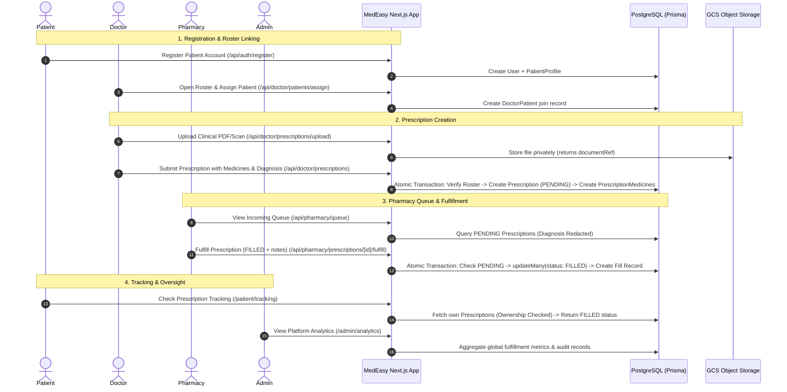

# MedEasy — Prescription-to-Order Tracking System

> **A role-based, end-to-end digital prescription lifecycle management and fulfillment tracking system built with Next.js 14, TypeScript, Prisma ORM, and PostgreSQL.**

[](https://github.com/kalviumcommunity/SW2627_Nextjs_Prescription_To_Order_Tracking_System/actions/workflows/ci.yml)
[-black.svg)](https://nextjs.org/)
[](https://www.postgresql.org/)
[](https://www.prisma.io/)
[](https://render.com/)

---

## 1. Project Overview

**MedEasy** is a production-grade healthcare web application designed to eliminate paper prescription fragmentation, prevent unauthorized medication dispensing, and provide real-time visibility across the entire prescription-to-fulfillment lifecycle.

### Context & Background
- **Academic Context:** Semester 3, Sprint 1
- **Program:** Simulated Work Project Track at **Kalvium**
- **Team Members:**
  - **Harshit Mohanta**
  - **Rudra Gopal**
  - **Divyesh RM**

The project originated from an entirely open-ended industry problem statement: *"Prescription-to-Order Tracking System"*. Working as an autonomous engineering team within the curriculum timeframe, we:
1. **Decoded the Problem:** Analyzed clinical communication gaps, regulatory constraints, and healthcare privacy principles.
2. **Defined the Product:** Derived user personas, state machines, business rules, and acceptance criteria into a comprehensive PRD and UX wireframes.
3. **Engineered the System:** Learned and implemented the full production stack from scratch—including server-side RBAC, atomic transactions, concurrency controls, object storage abstractions, containerization, CI pipelines, and cloud hosting on Render.

---

## 2. Problem Context

In traditional outpatient and ambulatory healthcare workflows, the prescription lifecycle suffers from critical vulnerabilities:
- **Physical Loss & Illegibility:** Paper prescriptions are easily misplaced, damaged, or misinterpreted, leading to dispensing errors.
- **Double Dispensing & Abuse:** Lack of centralized state machines permits duplicate fills of the same prescription at multiple pharmacies.
- **Privacy Breaches:** Handing full clinical diagnoses to dispensing technicians violates patient clinical privacy.
- **Zero Transparency:** Patients have no visibility into medication preparation status, resulting in unnecessary physical pharmacy visits.
- **Administrative Blindspots:** Healthcare administrators lack unified audit logs to track fulfillment turnaround or clinician prescription trends.

MedEasy replaces fragmented manual touchpoints with a single, role-isolated digital pipeline that enforces medical authorization, concurrency-safe fulfillment, and patient visibility.

---

## 3. Solution Overview

MedEasy connects four distinct healthcare stakeholders into an automated, unidirectional state machine:

```
┌───────────┐         ┌────────────────────────┐         ┌───────────────────────────┐
│  Patient  │ ──────▶ │ Doctor-Patient Roster  │ ──────▶ │ Doctor Issues Prescription │
│ Registers │         │   Frontend Assignment  │         │  (Multi-Med, Diagnosis,   │
└───────────┘         └────────────────────────┘         │       File Upload)        │
                                                         └─────────────┬─────────────┘
                                                                       │ Status: PENDING
                                                                       ▼
┌───────────────────────────┐         ┌──────────────────────────────────────────────┐
│  Patient Tracks Lifecycle │ ◀────── │         Central Pharmacy Queue               │
│ (Real-time Status Updates)│         │     (Diagnosis Redacted for Privacy)         │
└─────────────┬─────────────┘         └──────────────────────┬───────────────────────┘
              │                                              │
              │                               Atomic Process │ (Prisma Transaction)
              ▼                                              ▼
┌───────────────────────────┐         ┌──────────────────────────────────────────────┐
│  Administrator Monitors   │ ◀────── │ State: FILLED (with Fill log) or CANNOT_FILL │
│ (Audit Trail & Analytics) │         │           (Terminal States — Exactly-Once)   │
└───────────────────────────┘         └──────────────────────────────────────────────┘
```

---

## 4. User Roles & Access Boundaries

| Role | Main Responsibilities & System Capabilities | Primary Views & Routes |
|---|---|---|
| **`DOCTOR`** | Care roster management, searching/assigning patients via frontend modal, authoring multi-medicine prescriptions with clinical diagnosis and PDF/image uploads, viewing authored prescriptions, personal practice analytics. | `/doctor/dashboard`<br>`/doctor/patients`<br>`/doctor/prescriptions`<br>`/doctor/prescriptions/new`<br>`/doctor/analytics` |
| **`PHARMACY`** | Ingestion queue of pending prescriptions, verification of prescribed items, dispensing medications (`FILLED` with dispensing notes) or declining (`CANNOT_FILL`), fulfillment history, fulfillment metrics. **Diagnosis is strictly redacted.** | `/pharmacy/dashboard`<br>`/pharmacy/queue`<br>`/pharmacy/prescriptions`<br>`/pharmacy/history`<br>`/pharmacy/analytics` |
| **`PATIENT`** | Self-service registration, viewing personal prescription history, accessing attached clinical documents, tracking live fulfillment progress (`PENDING`, `FILLED`, `CANNOT_FILL`), viewing clinician diagnosis and instructions. | `/patient/dashboard`<br>`/patient/prescriptions`<br>`/patient/prescriptions/[id]`<br>`/patient/tracking` |
| **`ADMIN`** | System-wide governance, auditing all platform prescriptions, monitoring doctor rosters and licensing, inspecting central pharmacy status, analyzing platform-wide fulfillment rates and trends. Read-only oversight. | `/admin/dashboard`<br>`/admin/doctors`<br>`/admin/pharmacy`<br>`/admin/prescriptions`<br>`/admin/analytics` |

---

## 5. Core Implemented Features

Every feature listed below is verified in the active codebase:

1. **Authentication & Session Management:**
   - Stateless JWT authentication via NextAuth.js v4.
   - Salted and hashed passwords using `bcryptjs` (10 rounds).
   - Dynamic profile resolution during login to hydrate display names.
2. **Server-Side Role-Based Access Control (RBAC):**
   - Centralized enforcement via `lib/permissions.ts`.
   - Distinct HTTP 401 (Unauthenticated) vs. 403 (Forbidden) response semantics.
   - Client-side `RoleGuard` component provides user experience routing while server handlers enforce the true security boundary.
3. **Self-Service Registration:**
   - Public self-registration for `DOCTOR` (with medical license, specialization, phone) and `PATIENT` (with age, gender, contact info).
   - Direct self-registration for `ADMIN` and `PHARMACY` is strictly blocked (pre-provisioned infrastructure roles).
4. **Frontend Doctor-Patient Assignment:**
   - Interactive modal on `/doctor/patients` allowing doctors to search available unassigned patients and link them to their roster.
   - Backed by `GET /api/doctor/patients/available` and `POST /api/doctor/patients/assign`.
   - Enforces unique `[doctorId, patientId]` pairing in the `DoctorPatient` join entity.
5. **Multi-Medicine Prescription Authoring:**
   - Supports 1 to 50 medications per prescription.
   - Dynamic client form with dosage, frequency, duration, and medicine catalog dropdown.
   - Enforces unique medication entries per prescription (no duplicates).
   - Verifies that target patients are actively assigned to the authoring clinician.
6. **Prescription Attachment Upload & Storage:**
   - Upload endpoint (`/api/doctor/prescriptions/upload`) supporting PDF, JPEG, PNG, and WEBP up to 5MB.
   - Path-traversal sanitization and unique unguessable key generation (`rx-docs/{timestamp}-{uuid}-{name}.ext`).
   - Pluggable storage abstraction supporting **Google Cloud Storage** when credentials are configured, with a seamless in-memory fallback for local development and test runs.
   - Documents are streamed privately via `/api/prescriptions/[id]/document` with ownership verification and security headers (`X-Content-Type-Options: nosniff`).
7. **Clinical Privacy & Diagnosis Redaction:**
   - Database queries for pharmacy views (`pharmacyPrescriptionSelect`) omit the `diagnosis` column entirely.
   - Central sanitizer function (`sanitizePrescriptionForPharmacy`) scrubs sensitive medical fields from shared endpoints.
8. **Concurrency-Safe, Exactly-Once Fulfillment:**
   - Handled inside an atomic `prisma.$transaction`.
   - Enforces state check: only `PENDING` prescriptions can be fulfilled.
   - Executes an atomic conditional update (`updateMany` with `status: PENDING`).
   - Generates a permanent `Fill` record with a 1-to-1 unique constraint on `prescriptionId` (`@unique`).
   - Prevents duplicate dispensing under high concurrency, returning clean `409 Conflict` errors.
9. **Dual Terminal Fulfillment Outcomes:**
   - `FILLED`: Records dispensing timestamp, fulfillment notes, and pharmacy ID.
   - `CANNOT_FILL`: Marks terminal unfillable state without fabricating ghost inventory records.
10. **Live Patient Fulfillment Tracking:**
    - Dedicated tracking route (`/patient/tracking` and `/api/patient/prescriptions/[id]/tracking`) providing non-speculative progress descriptions for each lifecycle phase.
    - Direct query filtering (`where: { id, patientId }`) prevents Insecure Direct Object Reference (IDOR).
11. **Platform & Role Analytics:**
    - Doctor: total prescriptions, pending vs. filled counts, patient roster size.
    - Pharmacy: total received, pending count, filled count, fulfillment rate percentage, top 10 dispensed medicines, daily and weekly volume trends (`date_trunc`).
    - Admin: cross-platform metrics, doctor directory, pharmacy configuration status, global fulfillment percentage.
12. **Standardized API Error Architecture:**
    - Centralized `ApplicationError` class hierarchy (`lib/api-errors.ts`).
    - Automatic mapping of Prisma database exceptions (P2002 $\to$ 409 Conflict, P2025 $\to$ 404 Not Found).
    - Consistent response envelope: `{ error: { code: string, message: string } }`.

---

## 6. Technology Stack

| Layer | Technology | Purpose in MedEasy |
|---|---|---|
| **Framework** | Next.js 14.2.35 | Full-stack application framework utilizing the App Router, Server Components, and API Route Handlers |
| **Language** | TypeScript 5 | Strict static typing across domain models, API payloads, and components |
| **Frontend UI** | React 18 & TailwindCSS 3.4.1 | Component-based reactive interfaces with utility-first responsive styling |
| **Authentication** | NextAuth.js (Auth.js) v4.24.15 | Session management, Credentials provider, stateless JWT encryption |
| **Password Hashing**| bcryptjs 3.0.3 | 10-round salted password hashing |
| **ORM** | Prisma 6.19.3 | Type-safe database queries, schema migrations, and relational modeling |
| **Database** | PostgreSQL 15 | Relational database enforcing ACID transactions, foreign keys, and unique indexes |
| **Object Storage** | Google Cloud Storage (@google-cloud/storage 8.1.0) | Prescription attachment storage in production with private ACLs (in-memory mock for local dev) |
| **Containerization**| Docker & Docker Compose | Multi-stage production container build and local multi-service container orchestration |
| **Continuous Integration** | GitHub Actions | Automated CI pipeline: linting, typechecking, database migrations, unit/integration/security test execution, production build |
| **Application Hosting** | **Render** | Production web service deployment (Docker runtime) and managed cloud PostgreSQL |

---

## 7. Architecture Overview

### System Layering

```
┌────────────────────────────────────────────────────────────────────────┐
│                   Web Browser / Client (React 18)                      │
│      Role-Protected Layouts & Views (Doctor, Pharmacy, Patient, Admin) │
└───────────────────────────────────┬────────────────────────────────────┘
                                    │ HTTPS / JSON API / FormData
                                    ▼
┌────────────────────────────────────────────────────────────────────────┐
│                 Next.js 14 App Router (Server Layer)                   │
│                                                                        │
│   ┌────────────────────────────────────────────────────────────────┐   │
│   │ API Route Handlers (/app/api/*)                                │   │
│   └───────────────────────────────┬────────────────────────────────┘   │
│                                   ▼                                    │
│   ┌────────────────────────────────────────────────────────────────┐   │
│   │ Security & Authorization Gateway (lib/permissions.ts)           │   │
│   │ • requireAuth / requireRole    • canUserAccessPrescription     │   │
│   │ • canDoctorAccessPatient       • sanitizePrescriptionForPharmacy│   │
│   └───────────────────────────────┬────────────────────────────────┘   │
│                                   ▼                                    │
│   ┌────────────────────────────────────────────────────────────────┐   │
│   │ Domain Service Layer (lib/*-service.ts)                        │   │
│   │ • doctor-service   • pharmacy-service   • patient-service      │   │
│   │ • admin-service    • auth-service       • api-errors           │   │
│   └───────────────┬────────────────────────────────┬───────────────┘   │
└───────────────────┼────────────────────────────────┼───────────────────┘
                    │                                │
                    ▼                                ▼
┌───────────────────────────────────────┐  ┌─────────────────────────────┐
│              Prisma ORM               │  │  Storage Service Abstraction│
│        (Type-safe SQL Client)         │  │       (lib/storage.ts)      │
└───────────────────┬───────────────────┘  └──────────────┬──────────────┘
                    ▼                                     ▼
┌───────────────────────────────────────┐  ┌─────────────────────────────┐
│       PostgreSQL 15 Database          │  │ Google Cloud Storage Bucket │
│  (Users, Profiles, Roster, Rx, Fills) │  │  (Encrypted Private Objects)│
└───────────────────────────────────────┘  └─────────────────────────────┘
```

---

## 8. Main Application Flow



---

## 9. Security & Access Boundaries

MedEasy treats healthcare data security as an absolute architectural requirement:

1. **Server-Side Authorization Boundary:**
   Client-side route wrappers (`RoleGuard.tsx`) provide UI navigation and loading states. **The true security boundary is 100% enforced in server API handlers** via `lib/permissions.ts`. Tampering with client state cannot bypass server authorization.
2. **Clinical Privacy by Design:**
   Prescription diagnoses are strictly partitioned. Doctors, the issuing patient, and system administrators can view the diagnosis. Pharmacists receive complete medication details (generic name, dosage, frequency, duration) but **the diagnosis is redacted at both the query and API serializer levels**.
3. **Insecure Direct Object Reference (IDOR) Protection:**
   Resource fetching functions (`getPatientPrescriptionDetail`, `getDoctorPrescriptionDetail`) inject the caller's verified profile ID directly into the database query `where` clause. Users cannot inspect or manipulate other users' records by guessing sequential IDs or UUIDs.
4. **Mass Assignment Prevention:**
   All mutation endpoints whitelist exact allowed fields. For example, `POST /api/doctor/prescriptions` extracts only `patientId`, `diagnosis`, `documentRef`, and `medicines`. Client-supplied overrides for `status` or `doctorId` are strictly ignored.
5. **Path Traversal & Storage Security:**
   File uploads are sanitized against `..`, `/`, `\`, and null bytes. Filenames are assigned randomized UUID prefixes. Documents are served exclusively through an authenticated streaming route (`/api/prescriptions/[id]/document`) that validates prescription access rights before proxying bytes from object storage.

---

## 10. Data Model Overview

The database schema (`prisma/schema.prisma`) comprises nine relational models:

```mermaid
erDiagram
    User ||--o| DoctorProfile : "1-to-1 Profile"
    User ||--o| PharmacyProfile : "1-to-1 Profile"
    User ||--o| PatientProfile : "1-to-1 Profile"
    DoctorProfile ||--o{ DoctorPatient : "cares for"
    PatientProfile ||--o{ DoctorPatient : "assigned to"
    DoctorProfile ||--o{ Prescription : "authors"
    PatientProfile ||--o{ Prescription : "receives"
    Prescription ||--|{ PrescriptionMedicine : "contains"
    Medicine ||--o{ PrescriptionMedicine : "referenced in"
    Prescription ||--o| Fill : "has exactly one"
    PharmacyProfile ||--o{ Fill : "dispenses"

    User {
        String id PK
        String email UK
        String password
        UserRole role
    }
    DoctorProfile {
        String id PK
        String userId FK
        String specialization
        String licenseNumber UK
        String phone
    }
    PharmacyProfile {
        String id PK
        String userId FK
        String pharmacyName
        String pharmacyType
        String licenseNumber UK
        String phone
    }
    PatientProfile {
        String id PK
        String userId FK
        String name
        Int age
        String gender
        String contactInfo
    }
    DoctorPatient {
        String id PK
        String doctorId FK
        String patientId FK
    }
    Medicine {
        String id PK
        String name
        String genericName
        Boolean stockStatus
    }
    Prescription {
        String id PK
        String doctorId FK
        String patientId FK
        String diagnosis
        String documentRef
        PrescriptionStatus status
        DateTime filledAt
    }
    PrescriptionMedicine {
        String id PK
        String prescriptionId FK
        String medicineId FK
        String dosage
        String frequency
        String duration
    }
    Fill {
        String id PK
        String prescriptionId FK_UK
        String pharmacyId FK
        String notes
        DateTime filledAt
    }
```

---

## 11. Project Structure

```
.
├── app/                                # Next.js App Router root
│   ├── admin/                          # Admin portal pages
│   │   ├── analytics/                  # Platform-wide fulfillment metrics
│   │   ├── dashboard/                  # Platform summary dashboard
│   │   ├── doctors/                    # Doctor registry & roster oversight
│   │   ├── pharmacy/                   # Pharmacy account status
│   │   └── prescriptions/              # Global prescription audit table
│   ├── api/                            # REST Route Handlers
│   │   ├── admin/                      # Admin reporting & metrics endpoints
│   │   ├── auth/                       # NextAuth, register, password reset
│   │   ├── doctor/                     # Prescriptions, roster, assign, upload
│   │   ├── health/                     # Database healthcheck (/api/health/db)
│   │   ├── patient/                    # Patient prescriptions, tracking
│   │   ├── pharmacy/                   # Fulfillment queue, fulfill action, analytics
│   │   └── prescriptions/              # Detail lookup & private document streaming
│   ├── doctor/                         # Doctor portal pages
│   │   ├── analytics/                  # Practice prescribing trends
│   │   ├── dashboard/                  # Summary cards & recent activity
│   │   ├── patients/                   # Patient roster & Assignment modal
│   │   ├── prescriptions/              # Authored prescription directory
│   │   │   ├── [id]/                   # Prescription clinical detail view
│   │   │   └── new/                    # Multi-medicine creation wizard
│   │   └── profile/                    # Clinician profile details
│   ├── forgot-password/                # Password reset request view
│   ├── login/                          # Unified credentials sign-in view
│   ├── patient/                        # Patient portal pages
│   │   ├── dashboard/                  # Active prescriptions & health metrics
│   │   ├── prescriptions/              # Personal prescription list & detail
│   │   ├── profile/                    # Patient demographic profile
│   │   └── tracking/                   # Live fulfillment progress stepper
│   ├── pharmacy/                       # Pharmacy portal pages
│   │   ├── analytics/                  # Dispensing volume & trends
│   │   ├── dashboard/                  # Queue summary & daily counts
│   │   ├── history/                    # Historical fulfillment log
│   │   ├── prescriptions/              # Detailed prescription review
│   │   └── queue/                      # Pending prescription dispensing queue
│   ├── register/                       # Self-service registration
│   │   ├── doctor/                     # Clinician onboarding form
│   │   └── patient/                    # Patient onboarding form
│   ├── reset-password/                 # Password update token form
│   ├── globals.css                     # Global Tailwind styling
│   ├── layout.tsx                      # Root HTML layout with SessionProvider
│   └── page.tsx                        # Root entry redirect
├── components/                         # Modular React components
│   ├── auth/                           # RoleGuard, AuthForm, PasswordResetForm
│   ├── layout/                         # DashboardShell, Header, Sidebar
│   ├── prescriptions/                  # PrescriptionCard, Table, Details, Status
│   ├── providers/                      # NextAuth SessionProvider wrapper
│   └── ui/                             # Button, Card, Badge, Modal, Input, Spinner
├── docs/                               # Comprehensive project documentation
│   ├── database/                       # Data model and ER diagrams
│   ├── deployment/                     # Render deployment guide (render.md)
│   └── testing/                        # Test logs and authorization specs
├── lib/                                # Domain logic and backend services
│   ├── admin-service.ts                # Administrative aggregations
│   ├── api-errors.ts                   # Centralized error classes and handlers
│   ├── auth-service.ts                 # User creation and credential validation
│   ├── auth.ts                         # NextAuth configuration options
│   ├── doctor-service.ts               # Roster management & prescription issuance
│   ├── patient-service.ts              # Patient queries & tracking state text
│   ├── permissions.ts                  # Server-side RBAC & ownership predicates
│   ├── pharmacy-service.ts             # Concurrency-safe fulfillment logic
│   ├── prisma.ts                       # Global PrismaClient singleton
│   ├── session.ts                      # Server session retrieval helper
│   └── storage.ts                      # GCS & mock file storage service
├── prisma/                             # Database schema and migrations
│   ├── migrations/                     # Committed SQL migrations
│   ├── schema.prisma                   # Complete relational domain schema
│   └── seed.ts                         # Idempotent demo database seeder
├── public/                             # Static assets
├── scripts/                            # Custom automated test suites
├── .env.example                        # Documented environment variable template
├── .github/workflows/ci.yml            # GitHub Actions CI workflow
├── docker-compose.yml                  # Local development multi-container setup
├── Dockerfile                          # Multi-stage production Docker build
├── package.json                        # Dependencies, scripts, and engines
└── tsconfig.json                       # TypeScript compiler configuration
```

---

## 12. Local Setup & Installation

### Prerequisites
- **Node.js:** `20.x` LTS recommended
- **npm:** `10.x` or higher
- **PostgreSQL:** Local PostgreSQL 15 instance or Docker Desktop

### Option A: Standard Local Setup (Recommended)

1. **Clone the repository:**
   ```bash
   git clone https://github.com/kalviumcommunity/SW2627_Nextjs_Prescription_To_Order_Tracking_System.git
   cd SW2627_Nextjs_Prescription_To_Order_Tracking_System
   ```

2. **Install dependencies:**
   ```bash
   npm install
   ```

3. **Configure Environment Variables:**
   ```bash
   cp .env.example .env
   ```
   Configure `.env` with your database connection string and a generated `NEXTAUTH_SECRET`:
   ```bash
   # Generate a secure 32-byte secret
   openssl rand -base64 32
   ```

4. **Initialize Database:**
   ```bash
   # Run migrations
   npm run db:migrate

   # Populate with standard demo fixtures
   npm run db:seed
   ```

5. **Start Local Development Server:**
   ```bash
   npm run dev
   ```
   Open **http://localhost:3000** in your browser.

---

### Option B: Docker Compose Setup

Run both the PostgreSQL database and the Next.js development server in containerized isolation:

```bash
# 1. Create environment file
cp .env.example .env

# 2. Start PostgreSQL and the Next.js app with hot-reload
docker compose up -d

# 3. Apply migrations and seed data in the running container
docker compose exec app npm run db:migrate
docker compose exec app npm run db:seed

# 4. View logs
docker compose logs -f app
```

To stop containers while preserving database volume data:
```bash
docker compose down
```

*(To completely wipe the database volume: `docker compose down -v`)*

---

## 13. Useful npm Commands

All commands below are defined in `package.json`:

| Command | Action |
|---|---|
| `npm run dev` | Starts Next.js development server on port 3000 with hot-reload |
| `npm run build` | Generates Prisma client and creates optimized production build |
| `npm start` | Starts Next.js standalone production server |
| `npm run lint` | Executes ESLint across all TypeScript and React files |
| `npm run db:migrate` | Applies development migrations and regenerates Prisma Client |
| `npm run db:migrate:deploy` | Applies pending production migrations (`npx prisma migrate deploy`) |
| `npm run db:seed` | Runs `prisma/seed.ts` to reset and insert standard demo fixtures |
| `npm run db:studio` | Opens visual Prisma database GUI at `http://localhost:5555` |
| `npm run db:validate` | Validates syntax and relations in `prisma/schema.prisma` |
| `npm run docker:up` | Starts all services via Docker Compose in detached mode |
| `npm run docker:down` | Stops Docker Compose containers safely |
| `npm test` | Runs the full backend security and regression audit (`test-day17-backend-security.ts`) |

---

## 14. Testing Strategy & Automation

MedEasy incorporates 23 custom automated test suites in the `scripts/` directory, executed using `tsx`:

```bash
# Core Security & RBAC Audit
npm test                               # Full Day 17 backend security & abuse audit
npm run test:auth                      # Authentication & session token tests
npm run test:authz                     # Role isolation matrix & 401/403 disambiguation

# Doctor Workflows
npm run test:doctor                    # Doctor profile & roster verification
npm run test:doctor:create             # Multi-medicine prescription issuance & validation
npm run test:doctor:analytics          # Practice analytics & calculation accuracy
npm run test:doctor-integration        # End-to-end doctor workflow

# Pharmacy Workflows & Concurrency
npm run test:pharmacy                  # Queue ingestion & diagnosis redaction
npm run test:pharmacy-fulfillment      # Concurrency-safe fulfillment & terminal state checks
npm run test:pharmacy-integration      # Pharmacy state transition integration

# Patient & Admin Workflows
npm run test:patient                   # Patient dashboard & IDOR-proof tracking
npm run test:admin                     # Admin metrics, audit table, and roster oversight
npm run test:admin:frontend            # Admin frontend API contract verification

# Regression & Storage
npm run test:day16-regression          # Complete system-wide regression test
npm run test:day19                     # GCS cloud storage & local fallback verification
npm run test:smoke                     # Post-deployment health & connectivity smoke check
```

---

## 15. Production Deployment (Render)

MedEasy is designed and verified for deployment as a **Docker Web Service on Render** with an associated **Render Managed PostgreSQL** database.

> **Note on Deployment Architecture:** Early sprint prototypes explored Google Cloud Run. The final, verified deployment platform for MedEasy is **Render**, utilizing Docker containerization and Render Managed PostgreSQL. Google Cloud Storage is utilized strictly for prescription attachment object storage.

### Deployment Configuration Summary

1. **Database:** Render Managed PostgreSQL (same region as Web Service). Copy the **Internal Database URL** for zero-latency private networking.
2. **Web Service Settings:**
   - **Environment:** `Docker`
   - **Dockerfile Path:** `./Dockerfile`
   - **Docker Context:** `.`
   - **Pre-Deploy Command:** `npx prisma migrate deploy`
   - **Health Check Path:** `/api/health/db`
3. **Required Environment Variables (configured in Render Dashboard):**
   - `NODE_ENV`: `production`
   - `DATABASE_URL`: Internal PostgreSQL connection string
   - `NEXTAUTH_URL`: Canonical public URL (e.g., `https://medeasy.onrender.com`)
   - `NEXTAUTH_SECRET`: Strong 32-character random string
4. **Prescription Document Storage (GCS):**
   - Configure `GCP_PROJECT_ID`, `GCP_CLIENT_EMAIL`, `GCP_PRIVATE_KEY`, and `GCP_STORAGE_BUCKET` in Render secret settings.
   - If omitted, the application utilizes its in-memory fallback (suitable for demonstration).

Refer to [docs/deployment/render.md](docs/deployment/render.md) for detailed deployment steps.

---

## 16. Demo & Evaluation Walkthrough

To evaluate the complete end-to-end workflow on a freshly seeded system:

1. **Reset Database with Demo Fixtures:**
   ```bash
   npm run db:seed
   ```
2. **Pre-Seeded Demo Accounts:**
   - **Doctor:** `dr.sarah@medeasy.demo` (General Medicine, License `DOC-LIC-1001`)
   - **Doctor:** `dr.john@medeasy.demo` (Pediatrics, License `DOC-LIC-1002`)
   - **Pharmacy:** `pharmacy@medeasy.demo` (MedEasy Central Pharmacy, License `PHARM-LIC-5001`)
   - **Patient:** `patient.alice@medeasy.demo` (Alice Johnson, Age 34)
   - **Patient:** `patient.robert@medeasy.demo` (Robert Miller, Age 52)
   - **Admin:** `admin@medeasy.demo` (System Administrator)
3. **Step-by-Step Demonstration Flow:**
   - **Step 1 — Self-Service Registration:** Navigate to `/register/patient` and register a new patient (e.g., *Jane Doe*).
   - **Step 2 — Doctor-Patient Assignment:** Log in as `dr.sarah@medeasy.demo`. Go to `/doctor/patients`. Click **"Assign Patient"**, search for *Jane Doe*, and assign her to your care roster. Notice Jane now appears in your active roster!
   - **Step 3 — Create Prescription:** Click **"Create Prescription"** for Jane. Enter diagnosis (`Acute Bronchitis`), select medications from the catalog (e.g., Amoxicillin 500mg, twice daily for 7 days), attach a sample PDF, and submit. The prescription status is now `PENDING`.
   - **Step 4 — Pharmacy Queue & Fulfillment:** Log in as `pharmacy@medeasy.demo`. Go to `/pharmacy/queue`. Observe the new prescription. Notice the diagnosis is **redacted**. Click **"Fulfill"**, add dispensing notes, and submit. Status transitions to `FILLED`.
   - **Step 5 — Patient Tracking:** Log in as the patient. Go to `/patient/tracking`. Observe the live stepper showing `FILLED` with dispensing details.
   - **Step 6 — Admin Audit:** Log in as `admin@medeasy.demo`. Inspect `/admin/dashboard` and `/admin/prescriptions` to view the full audit trail and updated global fulfillment percentages.

---

## 17. Core Documentation Links

For deep architectural and implementation specifications, refer to:
- [PRD.md](PRD.md) — Product Requirements Document (Baseline, State Machine, Acceptance Criteria)
- [HLD.md](HLD.md) — High-Level Design (System Architecture, Layering, Fulfillment Integrity, Security)
- [LLD.md](LLD.md) — Low-Level Design (Endpoint Maps, File Traces, Prisma Schema, Concurrency Proof)

---

## 18. Current Scope & Future Roadmap

### In Scope (Fully Implemented)
- Complete prescription lifecycle (`PENDING` $\to$ `FILLED` / `CANNOT_FILL`).
- Interactive frontend Doctor-Patient assignment modal.
- Multi-medication prescriptions (1 to 50 meds) with unique constraint guards.
- Cloud object storage abstraction with private signed streaming.
- Clinical privacy enforcement via diagnosis field redaction.
- Concurrency-safe atomic transactions eliminating double fulfillment.

### Out of Scope / Future Improvements
- **Self-Service Pharmacy Registration:** Currently, one pre-provisioned central pharmacy account exists by design. Multi-pharmacy tenant registration is reserved for future releases.
- **Geographic Pharmacy Routing:** Prescriptions are currently ingested by a centralized pharmacy queue. Routing based on patient postal code is planned for Phase 2.
- **Inventory Stock Deduction:** The `stockStatus` flag is a demonstration catalog field; physical warehouse stock deduction and reorder triggers are outside current project scope.
- **Payment Processing:** Outpatient insurance claim adjudication and copay processing are planned for subsequent phases.

---

## 19. Team

Built with pride by:
- **Harshit Mohanta**
- **Rudra Gopal**
- **Divyesh RM**

*Semester 3, Sprint 1 — Kalvium Simulated Work Project Track*
